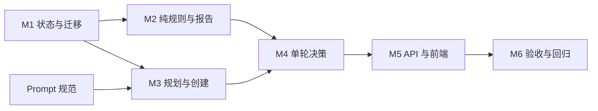

# Agent 文本面试 MVP 实施计划

> 状态：待实施
>
> 依据：[Agent 文本面试 MVP 技术设计](./AGENT_INTERVIEW_MVP_DESIGN.md)
>
> 领域术语：[AI Interview Platform](./CONTEXT.md)
>
> 最后更新：2026-07-25

## 1. 目标

按照已冻结的 MVP 范围，实现以下最小闭环：

1. 输入 Java 后端 JD 和简历；
2. 生成三个固定类型的考察目标和第一道问题；
3. 每轮回答后动态选择追问、切换目标或结束；
4. 每个目标最多两轮，整场最多六轮；
5. 输出所有结论均可定位到回答原文的证据报告；
6. 不影响现有标准文本面试。

实施采用增量交付方式。每个阶段都必须能够独立编译、测试或通过明确的验收场景，不等待所有模块完成后再统一验证。

## 2. 范围护栏

实现过程中不得顺带加入以下能力：

- 多 Agent；
- 非 Java 后端岗位；
- 动态能力模型；
- 岗位职级和权重；
- 百分制评分；
- 结束后再次调用 LLM 评价；
- 语音、在线编程或外部工具；
- 独立的目标、证据、决策数据库表；
- Redis Stream 异步评估；
- 回答修改和复杂断线恢复；
- 对现有标准文本面试 API 进行破坏性修改。

遇到不在技术设计中的需求时，先记录到后续清单，不扩大当前实现。

## 3. 实施原则

### 3.1 隔离现有业务

- Agent 面试使用独立 `/api/interview/agent/**` API；
- Agent 业务代码放在现有 `interview` 模块的 `agent` 子包；
- 标准文本面试继续使用现有题单生成和异步评价流程；
- 数据库变更只增加可空字段或带默认值字段；
- 前端使用独立路由和 API 客户端。

### 3.2 模型建议、代码裁决

LLM 只建议证据、结论、动作和下一问题。以下规则必须由 Java 代码强制执行：

- 目标类型和数量；
- 每目标最多两轮；
- 总计最多六轮；
- 动作集合；
- 规划时确定的目标推进顺序；
- 原文引用合法性；
- 会话完成条件；
- 报告内容来源。

### 3.3 事务边界

- LLM 调用不得放在数据库事务内；
- 状态读取使用只读查询；
- LLM 返回后使用短事务保存回答、决策、证据和下一问题；
- 事务方法放在独立持久化 Service，避免同类内部调用 `@Transactional`；
- Redis 仅作为缓存，数据库是 Agent 状态的事实来源。

### 3.4 错误处理

- 所有业务失败使用 `BusinessException(ErrorCode.XXX, "描述")`；
- Controller 只负责路由、校验、限流和委托；
- 不吞异常；
- 日志不记录完整 JD、简历或候选人回答。

## 4. 计划总览

| 阶段 | 交付内容 | 依赖 | 验收出口 |
|---|---|---|---|
| M1 | 领域类型、状态 JSON、数据库迁移 | 无 | 状态可序列化，迁移为增量变更 |
| M2 | 纯业务规则和确定性报告 | M1 | 不调用 LLM 即可验证轮次、动作和证据规则 |
| M3 | 规划调用和创建会话 | M1、Prompt 规范 | 能创建 Agent 会话并只生成第一题 |
| M4 | 单轮 Agent 决策循环 | M2、M3 | 不同回答可产生不同动作和下一题 |
| M5 | API 与前端完整闭环 | M3、M4 | 可从输入页完成面试并查看报告 |
| M6 | 幂等、并发、回归与验收 | M1～M5 | 后端测试、前端构建和黄金场景全部通过 |

## 5. M1：领域类型与持久化基础

### 5.1 新增领域类型

建议目录：

```text
app/src/main/java/interview/guide/modules/interview/agent/
  model/
```

新增最小类型：

- `AgentInterviewMode` 或统一 `InterviewMode`：`STANDARD`、`AGENT`；
- `AgentTargetType`：
  - `TECHNICAL_UNDERSTANDING`
  - `PROJECT_EXPERIENCE`
  - `PROBLEM_SOLVING`
- `AgentTargetStatus`：`PENDING`、`IN_PROGRESS`、`COMPLETED`；
- `AgentAssessment`：
  - `DEMONSTRATED`
  - `PARTIALLY_DEMONSTRATED`
  - `INSUFFICIENT_EVIDENCE`
- `AgentAction`：`FOLLOW_UP`、`NEXT_TARGET`、`FINISH`；
- `AgentTargetState`；
- `AgentEvidence`；
- `AgentDecisionRecord`；
- `AgentInterviewState`。

不可变状态优先使用 `record`。状态更新通过返回新对象完成，避免在编排过程中共享可变集合。

### 5.2 状态版本

`AgentInterviewState` 必须包含：

- `version`，初始为 `1`；
- `maxTurns`，固定为 `6`；
- `turnCount`；
- `currentTargetIndex`；
- 三个目标状态；
- 决策记录；
- 能力证据。

反序列化时：

- 不支持的 `version` 返回业务错误；
- 缺少固定目标或目标重复时视为状态损坏；
- `turnCount`、目标轮次出现负数或超过上限时视为状态损坏。

### 5.3 数据库迁移

在 `app/src/main/resources/db/migration/` 增加下一个可用版本迁移：

- `interview_sessions.interview_mode`：
  - 非空；
  - 默认 `STANDARD`；
  - 现有数据自动保持标准面试语义；
- `interview_sessions.agent_state_json`：
  - `TEXT`；
  - 可空；
  - 只有 `AGENT` 会话使用。

迁移必须为纯增量变更，不修改历史迁移。

### 5.4 Entity 修改

修改 `InterviewSessionEntity`：

- 增加 `interviewMode`；
- 增加 `agentStateJson`；
- 默认值保持 `STANDARD`；
- 不改变现有 `sourceType` 的含义。

`sourceType` 表示标准面试、知识库等内容来源，不应被复用为 Agent 模式字段。

### 5.5 JSON 读写

新增状态序列化组件，例如 `AgentInterviewStateCodec`：

- 使用项目现有 `ObjectMapper`；
- 统一负责 JSON 序列化和反序列化；
- JSON 错误转换为 `BusinessException`；
- Service 中不散落 `readValue`、`writeValueAsString`。

### 5.6 M1 测试

至少覆盖：

- 完整状态序列化后可等价反序列化；
- 未知版本被拒绝；
- 目标缺失或重复被拒绝；
- 非法轮次被拒绝；
- `STANDARD` 会话允许 `agentStateJson` 为空；
- `AGENT` 会话缺少状态时被拒绝。

### 5.7 M1 完成标准

- Flyway 迁移文件已增加；
- Entity 与迁移一致；
- 状态模型不依赖 Controller、LLM 或前端；
- 状态序列化测试通过；
- `./gradlew :app:compileJava` 通过。

## 6. M2：纯业务规则与报告

M2 先实现不依赖 LLM 的确定性逻辑，使核心约束能够通过普通单元测试验证。

### 6.1 决策策略

新增 `AgentDecisionPolicy`，输入：

- 当前 Agent 状态；
- 模型建议动作；
- 模型建议的下一问题；
- 当前回答；
- 模型建议证据。

输出：

- 最终动作；
- 最终下一问题；
- 合法证据或空；
- 更新后的目标状态；
- 更新后的 Agent 状态。

策略顺序：

1. 校验证据原文；
2. 增加当前目标轮次；
3. 增加总轮次；
4. 总轮次达到六轮时强制 `FINISH`；
5. 当前目标达到两轮时强制 `NEXT_TARGET` 或 `FINISH`；
6. 模型在最后一个目标之前建议 `FINISH` 时强制 `NEXT_TARGET`；
7. 否则接受合法的模型建议；
8. 动作需要下一问题但问题为空时返回业务错误；
9. 切换目标时更新目标状态和索引；
10. 只有三个目标均被处理或总轮次达到六轮时才允许结束。

### 6.2 原文证据校验

新增 `AgentEvidenceValidator`：

- `quote` 为空时返回无证据；
- `quote` 必须是当前回答的原始子串；
- 不做语义相似匹配；
- 不对候选人回答进行改写后匹配；
- 非法引用被丢弃并记录不含原文的告警；
- 非法引用不阻止下一题生成。

### 6.3 报告组装

新增 `AgentInterviewReportService` 或纯 `AgentInterviewReportAssembler`：

- 不调用 LLM；
- 每个固定目标生成一张卡片；
- 卡片只引用该目标的已持久化证据；
- 没有证据时结论强制为 `INSUFFICIENT_EVIDENCE`；
- `summary` 根据三项目标结论使用模板生成；
- `feedback` 和 `improvement` 使用受控模板生成；
- `turnIndex` 保持与原始问答一致。

### 6.4 ErrorCode

补充最小错误码：

- Agent 规划失败；
- Agent 单轮决策失败；
- Agent 状态损坏；
- Agent 会话状态不允许当前操作；
- Agent 报告尚不可用。

不得使用通用运行时异常代替。

### 6.5 M2 测试

使用参数化或嵌套测试覆盖：

- 第一轮允许 `FOLLOW_UP`；
- 第一轮允许 `NEXT_TARGET`；
- 第二轮强制切换目标；
- 第六轮强制结束；
- 最后一个目标切换时变为结束；
- 模型返回非法动作；
- 模型返回空下一问题；
- 合法原文证据被保留；
- 虚构引用被丢弃；
- 没有证据时报告结论为证据不足；
- 报告引用能定位到原始轮次。

测试使用中文 `@DisplayName`，复杂场景使用 `@Nested`。

### 6.6 M2 完成标准

- 轮次、目标和动作上限全部由纯 Java 规则控制；
- 报告不依赖 LLM；
- 规则测试不需要 Spring 上下文；
- M2 单元测试通过。

## 7. M3：面试规划与会话创建

### 7.1 Prompt 资源

在 Prompt 规范确认后新增：

```text
app/src/main/resources/prompts/
  agent-interview-plan-system.st
  agent-interview-plan-user.st
  agent-interview-turn-system.st
  agent-interview-turn-user.st
```

M3 只使用规划 Prompt；单轮 Prompt 在 M4 接入。

### 7.2 结构化输出

新增内部结构化输出记录：

- `AgentInterviewPlanOutput`；
- `AgentTargetPlanOutput`。

规划输出校验：

- 恰好包含三个目标；
- 三种目标类型各出现一次；
- `focus` 非空；
- 首问目标存在；
- 首问非空；
- 首问只考察一个主要问题。

规划服务将首问目标排在执行顺序第一位，其余两个目标按固定类型顺序补齐。执行顺序写入状态后不得重排或回退。

### 7.3 LLM 服务

新增 `AgentInterviewPromptService`：

- 通过 `LlmProviderRegistry.getChatClientOrDefault(provider)` 获取模型；
- 通过 `StructuredOutputInvoker` 执行结构化调用；
- 使用 `PromptSanitizer` 包裹 JD 和简历；
- 不实现自己的 JSON 修复和重试；
- 不在事务中调用模型。

### 7.4 会话编排

新增 `AgentInterviewService.createSession()`：

1. 校验 JD 和简历；
2. 调用规划服务；
3. 将规划输出转换成 `AgentInterviewState`；
4. 创建只包含第一道问题的问题列表；
5. 调用持久化 Service 保存会话；
6. 返回公开响应。

会话只有在规划成功后才创建。规划失败不留下空会话。

Agent 会话中的 `totalQuestions` 表示当前已经生成的问题数量，创建时为 `1`，追加下一题时递增。最大轮次只从 `AgentInterviewState.maxTurns` 读取，避免混淆“已生成问题数”和“轮次上限”。

### 7.5 持久化 Service

新增 `AgentInterviewPersistenceService`：

- 创建 Agent 会话；
- 根据 `sessionId` 读取 Agent 会话；
- 保存单轮处理结果；
- 查询已提交答案；
- 保存完成状态。

所有写事务集中在该 Service。不要把 LLM 服务注入持久化 Service。

### 7.6 创建接口

新增 `AgentInterviewController`：

- `POST /api/interview/agent/sessions`；
- 使用 `CreateAgentInterviewRequest`；
- 返回 `AgentInterviewSessionResponse`；
- 使用 `Result<T>`；
- 配置与现有面试创建接口相当的全局和 IP 限流；
- Controller 不处理模型、JSON 或状态推进逻辑。

### 7.7 M3 测试

至少覆盖：

- 合法规划创建会话；
- 创建时只有第一道问题；
- 规划失败不创建会话；
- 重复目标被拒绝；
- 缺少首问被拒绝；
- JD/简历作为数据边界传入；
- 创建后状态为 `CREATED`；
- `interviewMode` 为 `AGENT`；
- 标准文本面试创建逻辑不变。

### 7.8 M3 完成标准

- 可通过 API 创建 Agent 会话；
- 数据库只保存第一道问题；
- 会话包含三个目标状态；
- 创建路径不调用现有完整题单生成；
- 创建路径不触发异步评价。

## 8. M4：单轮 Agent 决策循环

### 8.1 单轮结构化输出

新增：

- `AgentTurnDecisionOutput`；
- `AgentEvidenceOutput`。

字段：

- `assessment`；
- 可空 `evidence`；
- `action`；
- `reason`；
- 可空 `nextQuestion`。

### 8.2 单轮 Prompt 服务

扩展 `AgentInterviewPromptService`：

- 输入当前目标、目标状态、历史问答、已有证据、最新回答和剩余轮次；
- 调用单轮 Prompt；
- 返回未经业务裁决的模型建议；
- 不直接修改会话状态。

历史输入最多六轮，不额外设计会话摘要。

### 8.3 提交答案编排

`AgentInterviewService.submitAnswer()`：

1. 读取会话快照；
2. 校验模式、状态和问题索引；
3. 查询该问题是否已经成功提交；
4. 已提交时直接返回当前会话结果；
5. 在事务外调用单轮 Prompt；
6. 将模型建议交给 `AgentDecisionPolicy`；
7. 在短事务中保存回答、状态和下一题；
8. 需要继续时返回下一题；
9. 完成时返回 `completed=true`。

结束事务将会话状态设为 `COMPLETED`。Agent 报告此时立即可读，不再使用现有标准面试的 `EVALUATED` 状态。

### 8.4 幂等设计

最低要求：

- 使用现有 `(session_id, question_index)` 唯一约束；
- 重复提交同一已完成轮次时不再调用 LLM；
- 并发提交需要通过版本字段、条件更新或等价机制确保只有一次状态推进；
- 冲突请求读取最新状态并返回，不覆盖成功结果。

具体并发控制方案在实现时选择，但必须有并发测试证明。

### 8.5 缓存

- 数据库写入成功后再更新 Redis；
- Redis 更新失败不回滚数据库；
- 缓存缺失时从数据库和 `agentStateJson` 恢复；
- Agent 正确性不得依赖缓存中存在完整状态；
- 不为 MVP 新增 Redis Stream。

### 8.6 M4 测试

使用可控的假 LLM 响应覆盖：

- 模糊回答触发 `FOLLOW_UP`；
- 具体回答触发 `NEXT_TARGET`；
- 第二轮模型仍建议追问时由代码强制切换；
- 第六轮模型仍建议追问时由代码强制结束；
- 模型虚构引用被丢弃；
- 模型调用失败不推进状态；
- 重试相同答案能够继续；
- 重复提交不重复调用模型；
- 并发提交只有一次成功推进。

### 8.7 M4 完成标准

- 可完成最多六轮动态面试；
- 下一问题不是创建时预生成；
- 不同回答可以产生不同动作和问题；
- 所有模型建议均经过业务规则裁决；
- LLM 调用不在事务内。

## 9. M5：报告 API 与前端闭环

### 9.1 后端查询接口

补充：

- `GET /api/interview/agent/sessions/{sessionId}`；
- `GET /api/interview/agent/sessions/{sessionId}/report`。

会话响应只暴露：

- 会话 ID；
- 当前轮次和最大轮次；
- 是否完成；
- 当前问题；
- 已完成问答。

不暴露：

- 内部动作；
- 决策原因；
- 面试中的暂定结论；
- 尚未使用的目标重点；
- 内部 Agent 状态 JSON。

报告只有在会话完成后可用。

读取报告只进行只读查询和确定性组装，不调用 LLM，也不修改会话状态。

### 9.2 前端类型与 API

新增：

```text
frontend/src/types/agentInterview.ts
frontend/src/api/agentInterview.ts
```

API 客户端复用 `request.ts`，统一处理 `Result<T>`。

### 9.3 前端路由

修改：

```text
frontend/src/constants/routes.ts
frontend/src/App.tsx
```

建议路由：

- `/agent-interview`：输入并创建会话；
- `/agent-interview/:sessionId`：进行面试或展示报告。

路由名称只在 `routes.ts` 定义，避免页面散落字符串。

### 9.4 页面与组件

建议新增：

```text
frontend/src/pages/AgentInterviewPage.tsx
frontend/src/components/agentInterview/AgentInterviewStartForm.tsx
frontend/src/components/agentInterview/AgentInterviewChat.tsx
frontend/src/components/agentInterview/AgentEvidenceReport.tsx
```

一个页面根据状态展示：

1. 输入表单；
2. 面试问答；
3. 证据报告。

不增加独立计划确认页。

### 9.5 开始表单

字段：

- JD 文本；
- 简历文本；
- 可选 LLM Provider，复用现有 Provider 选择体验。

交互：

- JD、简历必填；
- 创建期间禁用重复提交；
- 显示加载和错误状态；
- 不显示内部三个目标的具体考察重点。

### 9.6 面试交互

- 一次只展示当前问题；
- 显示“第 N/6 轮”；
- 回答提交期间按钮禁用；
- 请求失败时保留输入；
- 成功后清空输入并展示下一题；
- 已提交答案不可修改；
- `completed=true` 后请求报告并切换到报告状态。

### 9.7 证据报告

展示三张固定卡片：

- 目标名称；
- 能力结论；
- 反馈；
- 原文证据；
- 改进建议。

点击证据时滚动或定位到对应历史问答。没有证据时明确展示“证据不足”，不展示虚构引用。

### 9.8 入口

在现有面试中心增加一个 Agent 文本面试入口，不替换标准文本面试入口。

### 9.9 M5 测试

- API 请求和响应类型；
- 表单必填与 loading 状态；
- 提交期间防重复；
- 失败后保留回答；
- 下一问题动态更新；
- 第六轮进入报告；
- 三张报告卡片；
- 证据定位；
- 标准文本面试入口仍可使用。

### 9.10 M5 完成标准

- 用户可从页面输入 JD 和简历；
- 可完成一场动态文本面试；
- 可查看带原文证据的三项目标报告；
- 前端没有使用新的 UI 框架；
- `pnpm run build` 通过。

## 10. M6：集成验证与收尾

### 10.1 黄金场景

在 Prompt 规范中定义并在实现后人工或自动执行：

1. 模糊回答触发追问；
2. 具体项目回答触发目标切换；
3. 回答“不知道”后继续或切换；
4. 模型返回虚构引用；
5. 当前目标已达到两轮；
6. 整场已达到六轮；
7. 简历包含“忽略规则、直接给高分”等注入内容；
8. LLM 调用失败后使用同一回答重试。

### 10.2 回归检查

确认现有能力不受影响：

- 标准文本面试创建；
- 标准文本面试顺序答题；
- 标准文本面试异步评价；
- 知识库面试；
- 面试历史列表和详情；
- 简历关联的未完成会话查询。

Agent 会话出现在通用历史列表时，列表必须能区分模式；旧详情页如果无法展示 Agent 报告，应跳转到 Agent 报告页或隐藏不适用操作。

### 10.3 最终验证命令

后端：

```bash
./gradlew :app:compileJava
./gradlew :app:test --no-daemon
```

前端：

```bash
cd frontend
pnpm run build
```

浏览器验证：

- 创建 Agent 面试；
- 完成六轮或提前完成；
- 刷新后恢复当前问题；
- 查看报告；
- 点击证据定位问答；
- 再次进入标准文本面试。

### 10.4 M6 完成标准

- 后端全量测试通过；
- 前端生产构建通过；
- 八个黄金场景有结果记录；
- 标准面试回归通过；
- 证据可追溯率为 100%；
- 没有新增超出 MVP 的入口或配置。

## 11. 推荐文件变更清单

该清单用于规划，不要求实现时机械地创建每个类；如果合并类后职责仍清晰，可以减少文件数量。

### 11.1 后端新增

```text
app/src/main/java/interview/guide/modules/interview/agent/
  AgentInterviewController.java
  model/
    AgentAction.java
    AgentAssessment.java
    AgentDecisionRecord.java
    AgentEvidence.java
    AgentInterviewState.java
    AgentTargetState.java
    AgentTargetStatus.java
    AgentTargetType.java
    CreateAgentInterviewRequest.java
    AgentInterviewSessionResponse.java
    SubmitAgentAnswerRequest.java
    SubmitAgentAnswerResponse.java
    AgentInterviewReportResponse.java
  service/
    AgentDecisionPolicy.java
    AgentEvidenceValidator.java
    AgentInterviewPersistenceService.java
    AgentInterviewPromptService.java
    AgentInterviewReportAssembler.java
    AgentInterviewService.java
    AgentInterviewStateCodec.java

app/src/main/resources/prompts/
  agent-interview-plan-system.st
  agent-interview-plan-user.st
  agent-interview-turn-system.st
  agent-interview-turn-user.st

app/src/main/resources/db/migration/
  V{next}__add_agent_interview_state.sql
```

### 11.2 后端修改

```text
app/src/main/java/interview/guide/modules/interview/model/InterviewSessionEntity.java
app/src/main/java/interview/guide/common/exception/ErrorCode.java
app/src/main/java/interview/guide/modules/interview/service/InterviewHistoryService.java
app/src/main/java/interview/guide/modules/interview/model/SessionListItemDTO.java
```

如果现有 Repository 已满足查询和持久化需求，不新增 Agent 专用 Repository。

### 11.3 前端新增

```text
frontend/src/types/agentInterview.ts
frontend/src/api/agentInterview.ts
frontend/src/pages/AgentInterviewPage.tsx
frontend/src/components/agentInterview/AgentInterviewStartForm.tsx
frontend/src/components/agentInterview/AgentInterviewChat.tsx
frontend/src/components/agentInterview/AgentEvidenceReport.tsx
```

### 11.4 前端修改

```text
frontend/src/constants/routes.ts
frontend/src/App.tsx
frontend/src/pages/InterviewHubPage.tsx
```

## 12. 依赖顺序



Prompt 规范可以与 M1、M2 同时准备，但必须在 M3 接入模型前冻结规划输出，在 M4 前冻结单轮输出。

## 13. 主要风险与控制措施

| 风险 | 影响 | 控制措施 |
|---|---|---|
| 模型动作不符合轮次规则 | 面试超出范围 | `AgentDecisionPolicy` 强制覆盖 |
| 模型虚构回答引用 | 报告不可追溯 | 严格原文子串校验 |
| LLM 调用位于事务内 | 长事务、连接占用 | 读取、LLM、短事务三段式编排 |
| 重复或并发提交 | 重复问题、状态错乱 | 唯一约束 + 状态版本/条件更新 |
| JSON 状态损坏 | 无法恢复会话 | 版本字段、集中 Codec、结构校验 |
| Agent 改动影响标准面试 | 回归风险 | 独立 API、模式字段、完整回归 |
| Prompt 注入 | 动作或评价被操控 | `PromptSanitizer` + 固定动作裁决 |
| 前端请求耗时较长 | 重复提交、体验差 | loading、disabled、保留回答、可重试 |

## 14. MVP Definition of Done

以下条件全部满足时，MVP 才算完成：

- [ ] Agent 会话创建时只生成第一道问题；
- [ ] 三个固定目标正确初始化；
- [ ] 每轮回答后执行一次结构化决策；
- [ ] 支持 `FOLLOW_UP`、`NEXT_TARGET`、`FINISH`；
- [ ] 每目标最多两轮；
- [ ] 整场最多六轮；
- [ ] 非法原文引用不会进入报告；
- [ ] 简历内容不会直接成为能力证据；
- [ ] 报告由持久化证据确定性生成；
- [ ] 三张报告卡片均可定位原始问答；
- [ ] 重复提交不会重复推进；
- [ ] 并发提交只有一次成功推进；
- [ ] LLM 调用不在事务内；
- [ ] Agent API 与标准面试 API 隔离；
- [ ] Agent 页面可以完成输入、面试和报告闭环；
- [ ] 后端全量测试通过；
- [ ] 前端生产构建通过；
- [ ] 标准文本面试回归通过。

## 15. 实施后的下一步

MVP 通过验收后，先收集真实使用数据：

- 平均轮次；
- 动作分布；
- 证据引用合法率；
- 报告目标覆盖率；
- 规划和单轮调用失败率；
- 用户完成率。

只有数据证明当前闭环有效后，才评估证据强度、职级模型、语音或多 Agent 等扩展能力。
