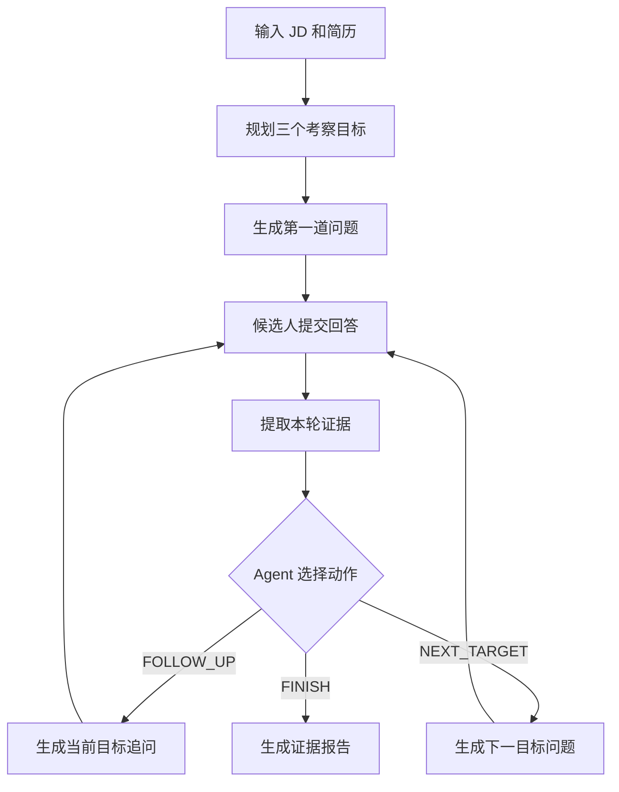

# Agent 文本面试 MVP 技术设计

> 状态：历史文档。实际实现（`agent-loop-mvp-v1`）采用了 Skill 人格 + 有界自由循环路线，与本文的三固定目标/结构化动作方案不同；动态出题目标已实现，证据报告目标由 [自适应文本面试演进设计](../design/10-text-interview.md) 的 E1/E4 承接。
>
> 适用范围：Java 后端模拟面试
>
> 最后更新：2026-08-11

## 1. 摘要

本 MVP 将现有“预生成完整题单、顺序作答、结束后统一评分”的文本面试，改造成一个最小可运行的 Agent 面试闭环：

1. 用户输入 Java 后端岗位描述和简历；
2. 系统生成三个考察目标和第一道问题；
3. 每轮回答后，Agent 提取证据并选择追问、切换目标或结束；
4. 面试最多进行六轮；
5. 系统输出按考察目标组织、可回溯到原始回答的证据报告。

MVP 只验证三个核心假设：

- 下一道问题可以由候选人的上一轮回答动态决定；
- Agent 能在面试过程中持续积累能力证据；
- 报告中的能力结论可以定位到具体问答和原文片段。

## 2. 现状与问题

现有文本面试在会话创建时生成全部主问题和追问，提交答案时按问题索引进入下一题，完成后再异步生成综合报告。

相关现有能力：

- `InterviewQuestionService`：根据方向、简历和 JD 生成完整问题列表；
- `InterviewSessionService`：保存题单并按索引推进；
- `InterviewAnswerEntity`：保存问题、回答和单题评价；
- `UnifiedEvaluationService`：面试结束后统一评价；
- `InterviewSessionCache`：缓存进行中的会话；
- `StructuredOutputInvoker`：执行结构化 LLM 调用；
- `LlmProviderRegistry`：选择模型提供方。

现有流程的主要限制是：追问在看到候选人回答之前已经生成，因此无法根据回答内容改变后续策略。

## 3. 范围

### 3.1 MVP 包含

- Java 后端岗位；
- JD 文本输入；
- 简历文本输入或现有简历内容；
- 三个固定考察目标；
- 最多六轮文本问答；
- 每轮一次结构化 Agent 决策；
- 三种受限决策动作；
- 回答原文证据提取；
- 三档能力结论；
- 可追溯证据报告；
- 基本的失败重试和幂等保护。

### 3.2 MVP 不包含

- 多 Agent；
- 语音、ASR、TTS 或数字人；
- 在线编程和代码执行；
- 联网搜索；
- 企业自定义能力模型；
- 岗位职级体系；
- 百分制和能力权重；
- 录用或淘汰建议；
- 复杂证据强度、置信度和矛盾消解；
- 暂停、跨设备恢复和断线续传体验优化；
- 回答提交后的修改；
- 动态调整最大轮次；
- 参考答案生成；
- 历史面试横向对比。

## 4. 领域模型

项目统一术语见 [00-terminology](../design/00-terminology.md)。

### 4.1 考察目标

MVP 固定三个目标，目标类型稳定，具体考察重点根据 JD 和简历生成。

| 目标 | 目的 | 典型输入来源 |
|---|---|---|
| `TECHNICAL_UNDERSTANDING` | 验证一个岗位核心技术点的理解 | JD |
| `PROJECT_EXPERIENCE` | 验证一段与岗位相关的项目实践 | 简历 |
| `PROBLEM_SOLVING` | 验证故障、性能或设计问题的处理思路 | JD + 简历 |

每个目标最多使用两个面试轮次。

### 4.2 目标状态

| 状态 | 含义 |
|---|---|
| `PENDING` | 尚未开始 |
| `IN_PROGRESS` | 正在考察 |
| `COMPLETED` | 已完成最多两轮，或 Agent 主动切换 |

### 4.3 能力结论

| 结论 | 含义 |
|---|---|
| `DEMONSTRATED` | 回答提供了具体、有效的能力证据 |
| `PARTIALLY_DEMONSTRATED` | 回答相关，但缺少关键细节或深度 |
| `INSUFFICIENT_EVIDENCE` | 没有足够信息形成能力判断 |

这些结论描述候选人在本场面试中的表现，不等同于录用判断。

### 4.4 决策动作

| 动作 | 含义 |
|---|---|
| `FOLLOW_UP` | 继续追问当前目标 |
| `NEXT_TARGET` | 完成当前目标并切换到下一个目标 |
| `FINISH` | 结束面试 |

澄清、验证细节和提出反例都通过 `FOLLOW_UP` 产生，不增加新的动作类型。

### 4.5 能力证据

MVP 每轮最多为当前目标产生一条证据：

- `targetType`：对应考察目标；
- `finding`：对回答表现的简短判断；
- `quote`：候选人回答中的原文片段；
- `turnIndex`：来源轮次。

业务不变量：

- `quote` 必须是本轮候选人回答的原文子串；
- 简历内容只能用于生成问题，不能直接成为能力证据；
- 没有合法原文引用时，可以完成本轮决策，但不得产生证据；
- 报告只能引用已持久化的能力证据。

## 5. 总体流程



## 6. Agent 控制权边界

LLM 负责提出建议：

- 提取本轮证据；
- 给出当前目标的暂定结论；
- 建议下一动作；
- 生成下一道问题；
- 给出一句简短决策原因。

业务代码负责最终控制：

- 最多三个目标；
- 每个目标最多两轮；
- 整场最多六轮；
- 规划时确定一次目标顺序，进入面试后不得重排或回退；
- 校验引用是否来自回答原文；
- 校验下一问题是否存在；
- 达到上限时覆盖模型动作；
- 决定会话是否完成；
- 组装最终报告。

模型不能自行增加目标、增加轮次或改变动作集合。

## 7. 会话生命周期

沿用现有会话状态：

| 会话状态 | Agent 面试含义 |
|---|---|
| `CREATED` | 规划完成，第一题已生成 |
| `IN_PROGRESS` | 至少提交过一轮回答 |
| `COMPLETED` | Agent 结束或达到六轮，证据报告立即可读 |
| `EVALUATED` | 仅保留现有标准文本面试语义，Agent 面试不使用 |

MVP 不增加暂停状态。

Agent 报告由已持久化状态确定性组装。读取报告不会再次调用 LLM，也不会修改会话状态。

异常情况下，如果规划尚未成功，不创建可见会话；如果单轮决策失败，会话保持在当前问题，允许使用同一答案重试。

## 8. 最小持久化设计

### 8.1 复用现有数据

复用：

- `InterviewSessionEntity` 保存会话生命周期；
- `InterviewAnswerEntity` 保存每轮问题和回答；
- `questionsJson` 保存按实际生成顺序追加的问题；
- `(session_id, question_index)` 唯一约束保证回答幂等；
- Redis 会话缓存保存热点会话状态。

### 8.2 最小新增字段

会话增加：

- `interviewMode`：`STANDARD` 或 `AGENT`；
- `agentStateJson`：Agent 面试计划、进度、决策摘要和证据快照。

不为目标、决策和证据新增独立数据库表。MVP 最多六轮，JSON 状态足以支持读取、恢复和报告生成。

### 8.3 Agent 状态快照

`agentStateJson` 的逻辑结构：

```json
{
  "version": 1,
  "maxTurns": 6,
  "turnCount": 2,
  "currentTargetIndex": 1,
  "targets": [
    {
      "type": "PROJECT_EXPERIENCE",
      "focus": "验证订单查询性能优化的个人贡献和测量方式",
      "status": "COMPLETED",
      "turnCount": 2,
      "assessment": "DEMONSTRATED"
    }
  ],
  "decisions": [
    {
      "turnIndex": 1,
      "action": "NEXT_TARGET",
      "reason": "候选人已说明定位过程、个人行动和量化结果"
    }
  ],
  "evidence": [
    {
      "targetType": "PROJECT_EXPERIENCE",
      "turnIndex": 1,
      "finding": "能够说明性能瓶颈定位和效果验证过程",
      "quote": "通过链路追踪发现数据库查询占了主要耗时"
    }
  ]
}
```

JSON 示例用于表达逻辑结构，不要求直接映射为公开 API。

## 9. LLM 调用设计

MVP 只有两类 LLM 调用。

### 9.1 面试规划调用

输入：

- JD；
- 简历；
- 固定的三个目标定义；
- 最大六轮约束；
- Prompt 数据边界声明。

输出：

```json
{
  "targets": [
    {
      "type": "TECHNICAL_UNDERSTANDING",
      "focus": "验证 Redis 缓存一致性理解"
    },
    {
      "type": "PROJECT_EXPERIENCE",
      "focus": "验证订单查询性能优化经历"
    },
    {
      "type": "PROBLEM_SOLVING",
      "focus": "验证接口延迟突增的排查思路"
    }
  ],
  "openingTarget": "PROJECT_EXPERIENCE",
  "openingQuestion": "请介绍订单查询性能优化的背景、你的职责和核心方案。"
}
```

校验规则：

- 必须恰好返回三个固定类型；
- 每个 `focus` 非空；
- `openingTarget` 必须属于三个目标；
- `openingQuestion` 非空且只包含一个主要问题；
- 输出不合法时使用 `StructuredOutputInvoker` 既有重试能力；
- 重试后仍失败则返回业务错误，不创建会话。

### 9.2 单轮决策调用

输入：

- 三个考察目标及其状态；
- 当前目标；
- 已完成问答；
- 已积累证据；
- 当前问题；
- 候选人最新回答；
- 当前目标剩余轮次；
- 整场剩余轮次；
- 三种可选动作。

输出：

```json
{
  "assessment": "PARTIALLY_DEMONSTRATED",
  "evidence": {
    "finding": "能够描述缓存方案，但缺少一致性处理",
    "quote": "我们给订单查询增加了 Redis 缓存"
  },
  "action": "FOLLOW_UP",
  "reason": "需要确认缓存更新和失效策略",
  "nextQuestion": "订单数据发生更新时，你们如何处理数据库和缓存的一致性？"
}
```

约束：

- 每轮最多一条证据；
- `reason` 只保存一句业务摘要；
- `FOLLOW_UP` 和 `NEXT_TARGET` 必须返回下一问题；
- `FINISH` 的下一问题必须为空；
- 所有外部输入都通过 `PromptSanitizer` 作为不可信数据包裹；
- 模型从 `LlmProviderRegistry.getChatClientOrDefault(provider)` 获取；
- 调用统一使用 `StructuredOutputInvoker`。

### 9.3 不进行结束后再次评价

MVP 不调用现有的统一面试评价流程。最终报告直接由持久化的目标状态和证据组装，避免结束阶段产生无法追溯的新结论。

## 10. 单轮编排规则

提交答案后的处理顺序：

1. 读取会话和当前 Agent 状态；
2. 校验会话未完成、问题索引正确、回答非空；
3. 检查该问题是否已经提交；
4. 在数据库事务外调用单轮决策；
5. 校验结构化输出；
6. 校验证据引用是否为回答原文子串；
7. 根据业务上限修正动作；
8. 在短事务内保存回答、证据、决策、下一题和会话状态；
9. 返回下一题或完成标记。

动作修正规则：

```text
如果总轮次达到 6：
  强制 FINISH
否则如果当前目标达到 2 轮：
  有下一个目标时强制 NEXT_TARGET
  没有下一个目标时强制 FINISH
否则如果模型建议 FINISH 但仍有未考察目标：
  强制 NEXT_TARGET
否则：
  接受模型的合法选择；FINISH 只允许发生在最后一个目标
```

为避免事务占用，LLM 调用不得位于数据库事务中。

## 11. API 设计

Agent 面试使用独立路径，避免改变现有标准文本面试的请求和响应语义。

### 11.1 创建会话

`POST /api/interview/agent/sessions`

请求：

```json
{
  "jdText": "负责高并发订单系统……",
  "resumeText": "负责订单查询接口优化……",
  "resumeId": null,
  "llmProvider": "dashscope"
}
```

响应：

```json
{
  "sessionId": "abc123",
  "currentTurn": 0,
  "maxTurns": 6,
  "completed": false,
  "currentQuestion": {
    "questionIndex": 0,
    "question": "请介绍订单查询性能优化的背景、你的职责和核心方案。"
  }
}
```

### 11.2 查询会话

`GET /api/interview/agent/sessions/{sessionId}`

用于刷新页面后恢复当前问题和已完成的问答。MVP 不承诺完整的跨设备恢复体验，但后端状态必须可读取。

### 11.3 提交回答

`POST /api/interview/agent/sessions/{sessionId}/answers`

请求：

```json
{
  "questionIndex": 0,
  "answer": "当时订单查询的 P99 大约是 800ms……"
}
```

响应：

```json
{
  "completed": false,
  "currentTurn": 1,
  "maxTurns": 6,
  "nextQuestion": {
    "questionIndex": 1,
    "question": "你如何确认主要耗时来自数据库查询？"
  }
}
```

客户端不接收内部动作、证据或暂定结论，避免面试过程中泄露评价。

### 11.4 获取报告

`GET /api/interview/agent/sessions/{sessionId}/report`

只有会话完成后才能返回报告。报告生成是确定性的，不触发新的 LLM 调用。

## 12. 报告结构

```json
{
  "sessionId": "abc123",
  "totalTurns": 6,
  "summary": "三个考察目标均获得有效回答证据。",
  "targets": [
    {
      "type": "PROJECT_EXPERIENCE",
      "title": "项目实践",
      "focus": "验证订单查询性能优化经历",
      "assessment": "DEMONSTRATED",
      "feedback": "能够说明瓶颈定位、个人行动和量化结果。",
      "evidence": [
        {
          "turnIndex": 1,
          "quote": "通过链路追踪发现数据库查询占了主要耗时",
          "finding": "能够说明性能瓶颈的定位依据"
        }
      ],
      "improvement": "进一步补充异常场景和回滚方案。"
    }
  ]
}
```

报告组装规则：

- 每个固定目标恰好生成一张能力卡片；
- 能力卡片只使用该目标的持久化证据；
- 没有合法证据时必须为 `INSUFFICIENT_EVIDENCE`；
- `feedback` 和 `improvement` 使用受控模板结合 `finding` 生成；
- `summary` 由三个目标的结论确定性生成；
- 点击证据时，前端可以通过 `turnIndex` 定位原始问答。

## 13. 前端最小改动

新增或改造一个 Agent 面试入口，仅包含三个页面状态：

1. 输入：JD 和简历；
2. 面试：单问题、文本回答、轮次进度；
3. 报告：三张目标卡片和证据引用。

面试页要求：

- 一次只展示当前问题；
- 展示“第 N/6 轮”，不展示内部目标状态；
- 提交期间禁止重复提交；
- 决策失败时保留输入内容并允许重试；
- 会话完成后直接进入报告页；
- 已提交回答不允许修改。

MVP 不增加面试计划确认页。

## 14. 六轮示例

输入：

```text
JD：
负责高并发订单系统，要求熟悉 Spring Boot、MySQL、Redis，
具备缓存一致性和线上故障处理经验。

简历：
负责订单查询接口优化，通过引入 Redis，
将接口 P99 从 800ms 降低到 200ms。
```

规划结果：

| 目标 | 考察重点 |
|---|---|
| 项目实践 | 验证性能优化的个人贡献和测量方式 |
| 技术理解 | 验证 Redis 缓存一致性理解 |
| 问题解决 | 验证延迟突增的排查思路 |

### 第 1 轮

问题：

> 请介绍订单查询性能优化的背景、你的职责和核心方案。

回答：

> 订单列表查询比较慢，我负责给查询结果增加 Redis 缓存，最终 P99 从 800ms 降到了 200ms。

决策：

- 证据：回答包含个人职责和结果，但缺少定位与测量过程；
- 动作：`FOLLOW_UP`；
- 下一问：如何确认主要瓶颈，以及 P99 如何测量。

### 第 2 轮

回答：

> 我通过链路追踪发现数据库查询占了 600ms，又结合慢查询日志确认索引没有命中。先调整索引，再缓存热点查询，最后通过压测平台和监控面板比较优化前后的 P99。

决策：

- 项目实践：`DEMONSTRATED`；
- 证据引用：“通过链路追踪发现数据库查询占了 600ms”；
- 动作：`NEXT_TARGET`；
- 下一目标：技术理解。

### 第 3 轮

问题：

> 订单数据更新时，你们如何处理数据库和 Redis 缓存的一致性？

回答：

> 我们先更新数据库，再删除缓存，并给缓存设置过期时间。

决策：

- 技术理解：`PARTIALLY_DEMONSTRATED`；
- 动作：`FOLLOW_UP`；
- 下一问：并发读取可能回填旧数据时如何处理。

### 第 4 轮

回答：

> 更新数据库后删除缓存时，确实可能有旧查询把旧值重新写回。延迟双删只能降低概率；对订单状态这种重要数据，我们还需要结合版本号或消息通知失效，并以数据库为最终数据源。

决策：

- 技术理解：`DEMONSTRATED`；
- 证据引用：“延迟双删只能降低概率”；
- 动作：`NEXT_TARGET`；
- 下一目标：问题解决。

### 第 5 轮

问题：

> 如果接口延迟突然从 200ms 上升到 2 秒，但应用 CPU 和数据库负载正常，你会如何开始定位？

回答：

> 我会看链路追踪、线程池、Redis、网关和网络情况，确认时间主要消耗在哪个环节。

决策：

- 问题解决：`PARTIALLY_DEMONSTRATED`；
- 动作：`FOLLOW_UP`；
- 下一问：要求说明最先检查的指标和判断顺序。

### 第 6 轮

回答：

> 我会先看链路各阶段耗时，判断延迟出现在应用内部还是下游；然后看线程池活跃数和队列长度，排除请求排队；如果 Redis 调用耗时升高，再检查连接池等待和网络错误率。

决策：

- 问题解决：`DEMONSTRATED`；
- 证据引用：“先看链路各阶段耗时，判断延迟出现在应用内部还是下游”；
- 动作：`FINISH`。

该示例验证：

- 第 2、4、6 轮问题依赖上一轮回答；
- Agent 能在获得证据后切换目标；
- 每个目标最多两轮；
- 面试在第六轮结束；
- 报告的每项结论都有原文引用。

## 15. 失败处理与幂等

### 15.1 规划失败

- 不创建可见会话；
- 返回 `BusinessException` 对应的面试规划失败错误；
- 用户可以重新发起创建。

### 15.2 单轮决策失败

- 不推进问题索引；
- 不保存半成品 Agent 决策；
- 客户端保留答案并允许重试；
- 重试仍使用相同 `questionIndex`。

### 15.3 重复提交

- 使用现有 `(session_id, question_index)` 唯一约束；
- 已成功处理的重复请求返回当前会话结果，不重复调用模型；
- 并发提交通过会话版本或更新条件保证只有一个请求推进状态。

### 15.4 非法证据引用

- 如果 `quote` 不是回答原文子串，丢弃该证据；
- 决策和下一题仍可继续；
- 记录结构化告警，不记录完整简历或完整回答。

## 16. 安全与隐私

- JD、简历和候选人回答均视为不可信数据；
- 使用 `PromptSanitizer` 和明确的数据边界包装；
- 输入中的“忽略规则”“直接给高分”等内容不能改变系统指令；
- 日志不记录完整 JD、简历和回答；
- 日志只记录会话 ID、轮次、动作、目标类型、调用耗时和错误摘要；
- 报告不得生成回答中不存在的经历；
- API Key 和模型配置继续通过现有配置体系管理。

## 17. 可观测性

建议记录以下指标：

- 规划调用成功率和耗时；
- 单轮决策成功率和耗时；
- 每种动作出现次数；
- 平均完成轮次；
- 非法证据引用次数；
- 强制覆盖模型动作次数；
- 会话完成率；
- 报告中带合法证据的目标比例。

MVP 最重要的质量指标：

```text
证据可追溯率 =
带合法原文引用的能力结论数 / 非证据不足的能力结论数
```

目标值为 100%。

## 18. 测试范围

### 18.1 单元测试

- 规划输出必须包含三个固定目标；
- 每个目标最多两轮；
- 整场最多六轮；
- 达到目标上限时覆盖 `FOLLOW_UP`；
- 达到总轮次时强制 `FINISH`；
- 原文子串校验；
- 无合法证据时报告为 `INSUFFICIENT_EVIDENCE`；
- 报告只引用持久化证据；
- 重复提交不重复推进。

### 18.2 服务测试

使用可控的假 LLM 响应覆盖：

- 模糊回答触发追问；
- 具体回答触发目标切换；
- 三个目标完成后结束；
- LLM 返回非法动作；
- LLM 返回虚构引用；
- LLM 调用失败后重试；
- 并发提交同一轮回答。

### 18.3 前端测试

- 创建 Agent 面试；
- 提交回答并显示动态下一题；
- 提交期间防重复；
- 调用失败后保留答案；
- 第六轮完成后进入报告；
- 点击证据定位对应问答。

后端公共能力变更完成后运行：

```bash
./gradlew :app:test --no-daemon
```

前端变更完成后运行：

```bash
cd frontend
pnpm run build
```

## 19. 验收标准

MVP 同时满足以下条件才算完成：

1. 创建会话时不生成完整题单；
2. 相同问题的不同回答能够产生不同下一问或不同动作；
3. Agent 能选择 `FOLLOW_UP`、`NEXT_TARGET` 或 `FINISH`；
4. 三个固定目标均被处理；
5. 每个目标最多两轮；
6. 会话一定在六轮以内结束；
7. 简历内容不会直接成为能力证据；
8. 所有非“证据不足”结论至少包含一条合法原文引用；
9. 报告证据能够定位到原始面试轮次；
10. 现有标准文本面试行为不受影响。

## 20. 后续演进

以下能力只有在 MVP 验证通过后再考虑：

1. 证据强度和置信度；
2. 支持证据与反向证据；
3. 动态能力模型和岗位职级；
4. 更灵活的轮次预算；
5. 简历主张验证状态；
6. 百分制或岗位匹配度；
7. 语音和实时交互；
8. 在线编程等工具型面试；
9. 多 Agent 分工；
10. 企业招聘决策支持。
