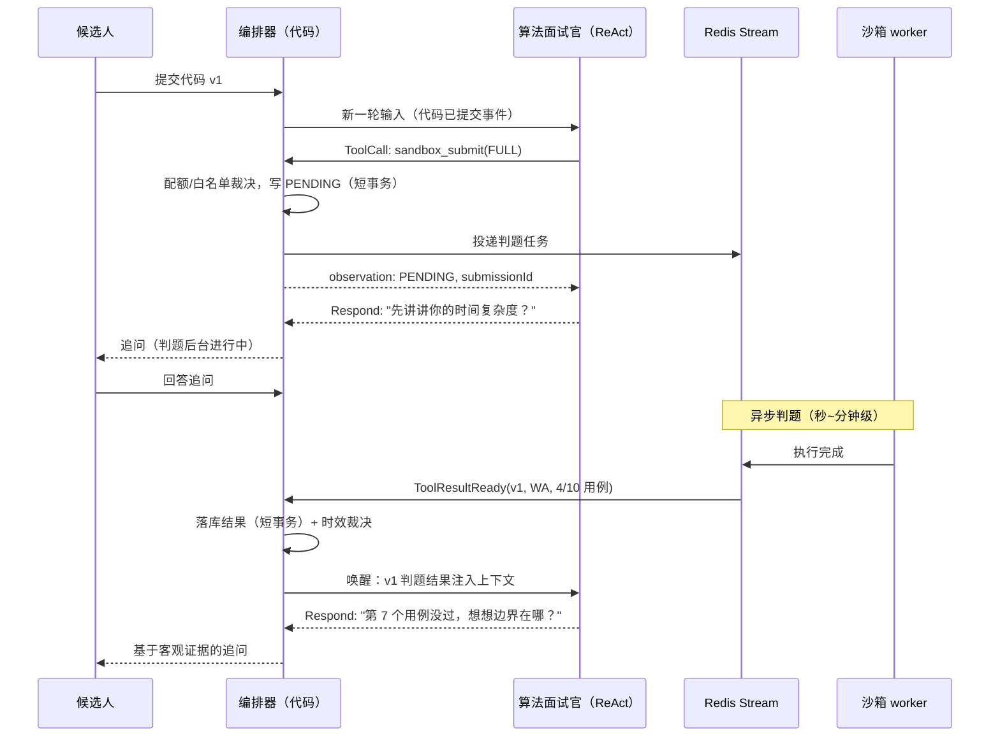

# 算法题面试设计：代码沙箱工具与延迟执行

> 状态：设计提案，待评审
>
> 前置文档：[Agent 面试平台演进设计](./01-platform-design.md)（§5.3 沙箱 P0 设计）、[自适应文本面试实现设计](./10-text-interview.md)（M0~M5 主线）
>
> 最后更新：2026-08-12

## 1. 定位与前提

本文激活平台设计中"Phase 2：代码沙箱 + 算法维度"的落地路径，把它从"推迟"状态拉回演进主线。三件事先钉死：

1. **继承全部架构不变量**。编排器是唯一状态修改者；工具是代码不是 LLM；评估可后置、证据不可后置——沙箱执行记录从第一天完整落库，格式满足 M5 评估可回填。
2. **不另起框架**。自适应文本面试的 `ToolGateway` 执行器接口从 M2 起就按"可能有副作用、可能长耗时"设计（演进设计 §6 明确预留）；本文是**激活这个预留**，不是给框架打补丁。
3. **延迟执行是一等公民的语义，不是性能优化**。代码判题天然秒级到分钟级，候选人体验上"等待判题"不该阻塞面试流程。本文的核心设计就是回答：当工具结果比 Agent 循环活得长，ReAct 内核该怎么办。

### 1.1 核心设计判断

三个贯穿全文的主张：

1. **沙箱是给 Agent 的工具，不是独立的判题流程**。算法面试官通过 function calling 发起执行，结果作为 `TOOL_RESULT` 客观证据进入证据链，与文本面试的题库检索、量规查询同构。判题结果只解决"正确性"，深度等级仍由追问决定（平台设计 §10 场景二不变）。
2. **延迟执行 = 提交即返回句柄 + 结果事件驱动唤醒**。内核永远不同步阻塞等待沙箱，也**不给模型提供轮询工具**——挂起与恢复由编排器代码完成，模型无感知、无选择权。
3. **判题结果分为"候选人的事实"和"系统的事故"**。AC/WA/CE/TLE/MLE/RE 是候选人的客观事实，可作为证据；IE（沙箱内部错误）是平台事故，**不得作为任何负面证据**，必须支持重判与后补。

## 2. 延迟执行语义（本文核心）

### 2.1 为什么不是同步调用

朴素方案：面试官发起 `ToolCall(run_code)`，内核同步阻塞等沙箱返回，再把 observation 喂回模型。它会失败在三个地方：

1. **有界循环被打破**。单轮 deadline（30s 级）对 LLM 合理，对判题不合理（排队 + 编译 + 跑用例，P99 必然超标）；把 deadline 放宽到分钟级，则"死循环烧 token"的防护同时失效。
2. **候选人体验锁死**。同步等待期间面试界面只能转圈——算法面试偏偏是最需要"边等边聊"的场景（让候选人口述复杂度分析、边界处理，恰是判题结果之外的关键证据）。
3. **事务与资源纪律被破坏**。长阻塞把虚拟线程、HTTP 连接、LLM 上下文一起吊住，违反"LLM/外部调用不在事务内"的既有纪律。

**结论**：执行请求与执行结果解耦，中间用 Redis Stream 传递——这正是仓库已有的 `AbstractStreamProducer` / `AbstractStreamConsumer` 模板的标准用法，不引入新中间件。

### 2.2 协议：三态工具 + 事件唤醒

暴露给算法面试官的工具只有一个：

| 工具 | 白名单角色 | 语义 | 返回 |
|---|---|---|---|
| `sandbox_submit(problem_id, code_ref, run_mode)` | 算法面试官 | 提交执行，**立即返回** | `{submissionId, status: PENDING}` |

`run_mode` 两档：

- `SAMPLE`：只跑公开样例（≤3 条），秒级返回，供"先跑个样例看看"的轻量验证——仍然异步，只是优先级高、超时短；
- `FULL`：完整测试集判题，正常排队。

**刻意不提供 `sandbox_result(submissionId)` 轮询工具**。轮询是模型的本能（ReAct 循环见到 PENDING 就会想再查一次），每次轮询都是一次模型调用 = 烧 token + 空转风险（演进设计 §11 场景一的新变种）。防护做在内核里，不靠 Prompt 祈祷。

内核侧的状态机扩展：

```text
Interviewer 发出 ToolCall(sandbox_submit)
  -> 编排器校验（白名单、执行配额、题目/代码引用合法）
  -> 短事务写入 sandbox_executions(PENDING) + 投递 Redis Stream
  -> observation "已提交，submissionId=xxx，判题中" 追加进轨迹
  -> 面试官继续 ReAct：可以 Respond（追问思路/结束本轮），循环正常终止
       …… 面试继续进行（候选人回答追问、甚至提交新版本代码）……
  -> 沙箱 worker 消费执行，结果落库（另一条短事务）
  -> 消费者向编排器发 ToolResultReady 事件
  -> 编排器裁决（turn 仍存在？会话仍活跃？）
  -> 以"工具结果"为输入开启新一轮面试官 ReAct 调用
       context = 原题 + 代码 + 判题结果（verdict、通过率、耗时、内存）
  -> 面试官产出基于客观结果的追问（"这段实现 TLE 了，瓶颈在哪？"）
```

三个裁决点全部在代码：

- **配额裁决**：每场会话执行次数上限（默认 20，可配）、同题目并发提交去重（候选人 10 秒内连点提交只认最后一次，`@RateLimit` 复用）；
- **时效裁决**：结果到达时若所属 turn 已被覆盖（候选人已提交更新版本代码），老结果照常落库标记 `superseded`，但**不触发**面试官唤醒——避免面试官对过期代码追问；
- **降级裁决**：队列积压或沙箱宕机超过配置阈值（默认 90s），编排器把该提交标记 `TIMEOUT_QUEUED`，主动唤醒面试官并告知"判题暂不可用"——面试官降级为纯代码走读模式继续面试，结果后补回填。

### 2.3 时序图



关键性质：候选人感知到的只有"提交 → 继续聊 → 面试官拿到结果后继续聊"，**等待时间被面试对话本身填满**。这是延迟执行的业务价值，不只是工程解耦。

### 2.4 对 ReAct 内核的改动（唯一一处框架级变更）

演进设计 §3.1 的循环语义需要补一条规则：

> ToolCall 执行结果允许是 `Pending(handle)`。此时 observation 立即写入"已受理"摘要，循环**不挂起**（模型继续决策，通常以 Respond 收尾）；真正的工具结果由事件以新输入身份进入后续循环。

即：挂起/恢复不在循环内部做"睡眠-唤醒"，而是**循环正常终止 + 事件触发新循环**。这复用了 M0 已有的"候选人提交回答 → 触发新一轮"的同一条唤醒链路，内核只多一种输入类型（`ToolResult` 事件），不多一种生命周期。

预算语义同步澄清：步预算和 deadline 约束的是**模型交互**，事件等待时间不计入任何预算——否则合法的长判题会被 deadline 误杀。

## 3. 沙箱服务边界与安全

沙箱是独立服务（`sandboxd`），通过内部 API 消费 Redis Stream 任务，**不嵌入面试服务进程**（平台设计 §5.3 不变）。

### 3.1 安全要求（不可妥协）

- 容器级隔离（gVisor/runsc 优先），每次执行独立容器或从预热池取用后销毁复用；
- **无网络访问**、只读根文件系统、可写目录限 tmpfs 且配额化；
- seccomp 白名单系统调用；禁止 fork 炸弹（PID 数上限）；
- CPU / 内存 / 墙钟时间硬限制（默认 2s CPU、256MB、10s 墙钟，按题目可配）；
- 源码大小上限（64KB）、单用例输出截断（64KB）、总输出截断；
- 每场会话执行次数上限（见 2.2 配额裁决）——防"把面试平台当免费算力"；
- 执行日志（编译输出、用例结果、资源消耗）完整留存——日志本身就是证据。

### 3.2 判题契约

```text
verdict: AC | WA | CE | TLE | MLE | RE | IE
```

- `AC/WA/CE/TLE/MLE/RE`：候选人代码的客观事实，可作证据；
- `IE`：沙箱自身故障（镜像缺失、OOM killer 误杀、worker 崩溃），**不计入候选人负面证据**，自动重试一次后仍 IE 则标记 `pending_rejudge`，支持后台重判回填；
- 结果摘要：通过用例数/总数、最长耗时、峰值内存、首个失败用例编号（**不含隐藏用例内容**——用例是平台资产，泄漏等于题库泄露）。

### 3.3 语言与题目

- 首发语言：Java、Python、C++（镜像各一，版本锁定写入配置）；
- 题目来源：优先题库检索（`question_bank_search` 扩展算法题类型），面试官现场改编题必须走"未审核题"标记（沿用演进设计 §11 场景四的降级链纪律）；
- 测试用例分公开（SAMPLE 可见）与隐藏（FULL 专用），隐藏用例内容**永不进入任何 LLM 上下文**——面试官只看到"用例 #7 失败"，不知道 #7 是什么，防止模型把用例泄露给候选人。

## 4. 数据模型增量

全部新表，与文本面试 M0 的表无迁移关系：

```text
algorithm_problems          算法题（题干、难度、标签、公开/隐藏用例引用、embedding）
sandbox_executions          执行记录 ★ 本设计的"证据不可后置"载体
  - id / session_id / turn_id / submission_seq      归属（turn_id 绑定出题轮次）
  - problem_id / language / code_ref / code_hash    代码存 S3，库内只存引用+哈希
  - run_mode / verdict / passed / total
  - time_ms / memory_kb / first_failed_case
  - status: PENDING/RUNNING/DONE/TIMEOUT_QUEUED
  - superseded_by                                 被更新提交覆盖时标记
  - created_at / finished_at
sandbox_execution_logs      执行日志引用（编译输出、用例明细，大字段存 S3）
```

纪律与 `agent_turns` 相同：写入路径唯一（编排器持久化服务 + Stream 消费者结果落库），源码原文不截断、不摘要——M5 评估上线后要能回答"这位候选人当时到底写了什么"。

`evidences` 表（M5）届时新增 `TOOL_RESULT` 类型引用 `sandbox_executions.id`，平台设计 §8 已预留。

## 5. 与既有模块的对接清单

| 对接点 | 改动 | 性质 |
|---|---|---|
| ReAct 内核 | 新增 `Pending` 工具结果类型 + `ToolResult` 事件输入类型 | 框架级，唯一一处 |
| `ToolGateway` | 注册 `sandbox_submit` 异步执行器（接口 M2 已预留） | 激活预留 |
| Stream 模板 | `AbstractStreamProducer`/`Consumer` 各实现一份判题管道 | 复用，不改模板 |
| 限流 | `@RateLimit` 加执行提交维度（会话级 + 用户级） | 复用注解 |
| 存储 | 源码与日志大字段走 RustFS/S3，库内只存引用 | 沿用现有 S3 设施 |
| 前端 | 代码编辑器组件 + 提交状态轮询（前端轮询无害，有害的是模型轮询） | 新增页面组件 |
| 记忆 | M3 起 `candidate_memory_topics` 记录"已考察算法题 ID"，复测去重 | 沿用写入纪律 |

异步纪律沿用既有规则：消费者处理前先校验会话/轮次仍存在，已删除则 ACK 丢弃；LLM 调用与沙箱调用均不在事务内。

## 6. 分阶段实施计划

依赖关系：A0 硬依赖文本面试 M0（内核）与 M2（工具框架）；A3 依赖 M5（评估体系）。

| 阶段 | 交付 | 出口验收 |
|---|---|---|
| A0 | 判题流水线纵向打通：题目/用例管理、`sandbox_submit` → Stream → 沙箱 worker → 结果落库、最简前端提交 | 候选人提交 → 异步判题 → 结果完整可追溯；IE 自动重试；配额超限被拒 |
| A1 | 延迟执行语义进内核：`Pending` 结果 + 事件唤醒 + 时效/降级裁决；面试官拿到结果后追问 | 桩沙箱延迟 5 分钟，面试流程不阻塞；v2 提交后 v1 结果不触发唤醒；沙箱黑洞时 90s 降级为代码走读 |
| A2 | 题库变体与防背诵、隐藏用例治理、执行配额与滥用监控、指标看板 | 同题变体检索可用；隐藏用例不出现在任何 LLM 调用日志中 |
| A3 | 判题证据进评估：`TOOL_RESULT` 证据类型启用，算法维度评级必须引用执行结果 | 算法维度工具证据占比 100%；历史 A0~A2 会话可回填评估 |

## 7. 主要失败场景与对策

**场景一：模型轮询烧 token（ReAct 空转的算法版）。**
症状：面试官看到 PENDING 后反复发起"查结果"调用，每轮一次 LLM 调用。对策：**物理上没有轮询工具可调**——结果只能由事件注入；内核把对同一 submission 的重复 submit 请求直接拒绝并注入提示。测试：桩模型每步都请求查结果，验证无额外沙箱调用、预算不因此耗尽。

**场景二：结果迟到且代码已过期，面试官对错版本追问。**
症状：候选人提交 v1 后又改出 v2，v1 的 WA 结果迟到，面试官却拿 v1 的失败追问 v2。对策：`sandbox_executions` 绑定 `submission_seq` + `code_hash`，唤醒裁决时校验"该结果对应的代码仍是当前有效版本"，过期结果落库标记 `superseded` 但不唤醒；面试官上下文中每个结果都带版本标签。测试：v1 判题中提交 v2，v1 结果到达后面试官上下文不含 v1 结果。

**场景三：沙箱故障/积压拖死算法维度。**
症状：队列积压 10 分钟，候选人干等，面试体验崩坏。对策：90s 排队阈值触发降级——面试官被告知"判题不可用"，转为代码走读模式（追问实现细节、复杂度、边界），结果后补回填；`IE` 恒不计负面证据。测试：沙箱黑洞（accept 不 respond）场景下，面试在降级模式下完成全流程，事后重判回填成功。

**场景四：候选人滥用执行配额或攻击沙箱。**
症状：死循环提交烧资源；代码尝试网络外联、读文件、fork 炸弹。对策：会话级执行次数上限 + `@RateLimit` 提交限流 + §3.1 隔离清单；异常行为进审计日志。测试：配额第 21 次提交被拒；含 `socket.connect` 的代码在无网络容器内 RE 且平台无出站连接。

## 8. 指标

- A0 起：判题端到端延迟分布（提交→结果落库）、队列深度、IE 率（目标 <1%）、配额命中率；
- A1 起：降级触发率、结果有效率（非 superseded 占比）、判题期间追问轮次占比（验证"等待被对话填满"的体验目标）；
- A3 起：算法维度工具证据占比（目标 100%）、判题结果与追问评级的一致性（校准用，WA 却被评 L3+ 需要人工复核）。

## 9. 与既有文档的关系

- 平台设计 §5.3：本文是其实现路径的细化与激活，安全要求与证据定位全部继承；
- 演进设计 §6：沙箱工具的预留声明由本文兑现，`ToolGateway` 异步执行器落地；
- 项目代码分析专项设计（MCP Pi SDK）：边界不变——那是**分析候选人既有项目代码**的只读工具，本文是**执行候选人现场编写代码**的沙箱工具，两者数据源、安全模型、证据语义均不同，不合并；
- 平台设计 §11 路线图中"Phase 2 已推迟"的注记，待本文评审通过后更新为 A0~A3 计划。
