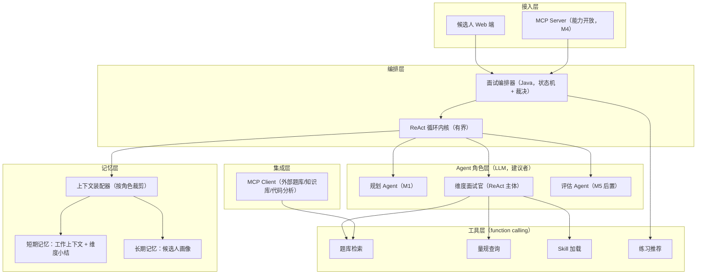
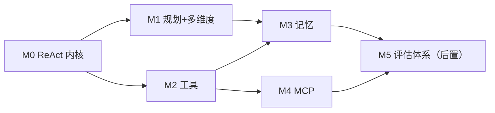

# 自适应文本面试实现设计：ReAct 内核、记忆、多 Agent 与工具/MCP

> 维护：Agent；上游设计决策以 `docs/design/` 为准。
>
> 状态：设计提案，待评审
>
> 2026-08-12 重写：抛弃 `agent-loop-mvp-v1` 代码约束，以 [Agent 面试平台演进设计](../design/01-platform-design.md) 为准重新设计实现路径；评估体系（深度量规、证据、报告）按决策后置到最后阶段。本文取代此前"基于现有代码演进"的版本。（2026-08-22：`agent-loop-mvp-v1` 代码已删除。）
>
> 最后更新：2026-08-12

## 1. 决策与前提

本文的四条输入决策（来自评审结论）：

1. **不兼容现役实现**。`agent-loop-mvp-v1`（Skill 人格 + 自由循环）作为探索归档，其实现形态不约束本设计（2026-08-22 已删除）；可复用的只有 `common/` 基础设施（`LlmProviderRegistry`、`StructuredOutputInvoker`、限流、异常体系）和"有界循环"的工程经验（deadline、步预算、乐观锁）。
2. **以平台设计为蓝本**：星型多 Agent、L0/L1/L2 三层记忆、工具客观验证、MCP 跨边界。
3. **评估后置**：深度量规、每轮评级、证据报告放在最后阶段（M5）。前序阶段的面试是"自适应出题但无结构化结论"。
4. **术语声明**："React 范式"指 **ReAct（Reasoning + Acting）**——模型每步产出"思考 + 动作"，执行后观察结果再进入下一步；不是前端 React 框架。

### 1.1 一条不可让渡的不变量（2026-08-12 已裁决确认）

> **评估可后置，证据不可后置。**

M0 起所有轮次的问题、回答、工具调用、模型动作必须完整持久化为结构化记录，格式满足"M5 评估上线后可对历史会话回填评估"。不做这条，评估后置就变成数据报废。

裁决结论：不兼容 v1 任何存储格式、不做双写迁移；`agent_turns` 从 M0 起结构化为行（方便观测与回填），只有会话/循环的瞬时状态（ReAct 轨迹、计划快照）允许用 JSON 字段。

## 2. 目标架构



继承平台设计的架构不变量：编排器是唯一状态修改者；工具是代码不是 LLM；同一份证据库两种视图（M5 启用）。

## 3. ReAct 循环内核（M0）

### 3.1 循环语义

每个 Agent 角色的一次运行是一个有界 ReAct 循环：

```text
loop:
  context  = ContextAssembler.build(role, sessionRef)   # 按角色裁剪，见第 5 节
  step     = model.nextStep(context)                     # 结构化输出：thought + action
  match step.action:
    Respond(question/finish) -> 校验后返回终止            # 对候选人可见的唯一出口
    ToolCall(name, args)     -> 白名单校验 -> 执行 -> observation 追加进轨迹
  超出步预算或 deadline    -> BusinessException，状态不推进
```

设计要点：

- **结构化动作集**：`Respond`（提问或结束）、`ToolCall`。`thought` 字段要求模型先写一句决策理由——它不进候选人视图，但**压缩后落入决策记录**（每场面试可回答"这一步为什么问这个"，这是未来可追溯性的底子）。
- **有界三件套**（继承 v1 工程经验）：单轮 ≤N 模型步、单轮工具调用次数上限、单轮 deadline（虚拟线程 + 超时中断）。预算按角色配置，不全局一刀切。
- **裁决点在编排器，不在模型**：工具白名单按角色授予（面试官不能调练习推荐）、终止输出校验（单问题、非空、长度上限）、轮次预算强制——模型只建议，代码裁决。
- **thought 不落全文**：决策记录只保存动作 + 一句理由摘要 + 工具调用摘要，不保存完整思维链。理由：日志合规（回答内容敏感）+ 存储成本 + 完整 CoT 对重放没有增量价值（重放用的是状态和动作，不是措辞）。

### 3.2 与 Spring AI 2.0 的对接

- 模型获取：`LlmProviderRegistry.getChatClientOrDefault(provider)`；
- 结构化输出：`StructuredOutputInvoker` + `BeanOutputConverter`，不自写重试；
- Prompt：`resources/prompts/` 下按角色拆分 `.st` 模板（`planner-system.st`、`interviewer-system.st` 等）；
- function calling：M2 起用 Spring AI `ToolCallback` 注册工具，但**调用发起权仍在循环内核**——模型的 tool 请求先经编排器白名单与预算校验再执行，不直接交给框架自动循环。

## 4. 多 Agent 角色拆分

星型结构（平台设计 4.1 的论证不再重复）：角色之间不直接对话，只通过编排器传递最小上下文。

| 角色 | 阶段 | 职责 | ReAct 差异 |
|---|---|---|---|
| 规划 Agent | M1 | JD + 简历 → 维度计划（维度、考察重点、轮次预算、建议工具/skill） | 单步为主，通常无工具调用 |
| 维度面试官 | M0 | 单维度内的 ReAct 主体：追问、换题建议、调工具 | 完整 ReAct 循环 |
| 评估 Agent | M5（后置） | 每轮深度评级 + 证据提取 | 单步结构化调用，无工具 |
| 报告措辞 | M5 后可选 | 结论 → 自然语言反馈（结论不可改写） | 单步 |

两个工程决策（沿用上一轮评审结论）：

1. **角色是配置不是类层级**。角色 = 独立 Prompt 模板 + 独立上下文装配规则 + 独立工具白名单 + 独立预算，由 `AgentRoleRegistry` 注册。新增角色不改循环内核。只有某角色需要独特工具链时才考虑物理拆分。
2. **评估后置期间，追问/换题由面试官 ReAct 自主决定 + 编排器预算裁决**（维度轮次上限、总轮次上限、维度覆盖强制）。这意味着 M0~M4 的"换题理由"是隐式的（在面试官 thought 里），M5 评估上线后才有显式评级驱动——这是评估后置的直接代价，接受它，但维度覆盖从 M1 起就是代码责任，不等 M5。

## 5. 记忆系统

> 三层记忆目标以 [34-memory-three-layer-spec.md](./34-memory-three-layer-spec.md) v4 为准。下文只记录 v3/当前代码基线；其中临时 Working 快照、正式 Planner 历史注入和出题前 Episode 注入均是待替换现状，不得覆盖 v4。

### 5.1 短期记忆（会话内，M0 起步、M3 完整）

三层结构：

- **工作轨迹**：当前 ReAct 循环的 thought/action/observation 序列，循环结束即弃，不落库（决策记录除外）。当前代码另从 PG 临时组装 `WorkingMemorySnapshot`；v4 将其替换为持久化 WorkState 的角色投影；
- **会话记忆**：已完成轮次（问题 + 回答原文 + 工具结果），DB 为事实源。一个已回答的 turn 就是一个事件 Episode（追问会产生新 turn，用 `parentTurnIndex` 关联）；
- **维度小结**（M3）：维度完成后把该维度问答压缩为小结（考察重点、关键发现、turnIndex 列表），后续轮次上下文中用小结替代原文。**小结只用于上下文导航，永远不作为任何结论的数据源**；压缩由独立 LLM 调用完成，编排器校验 turnIndex 存在性后入库。

上下文装配器是短期记忆的唯一出口。当前 v3 代码会让面试官看到本维度原文和历史维度小结、让 Planner 看到画像的“已覆盖主题”；v4 必须改为 34 号规格的专用角色视图。单次调用输入 token 上限入配置，超限报错不静默截断。

### 5.2 长期记忆（跨会话，M3）

新分类下长期记忆拆为 **Episodic Memory** 与 **Semantic Memory**；具体不可变事实、模式投影和双轨画像边界以 34 号 v4 规格为准。

评估后置决定了长期记忆**分两批填充**：

- M3 即可写入（不依赖评估体系）：
  - 已考察主题清单（维度 + focus + 时间）→ 复测选题去重；
  - 候选人自述技能与项目声明（结构化抽取，标记"未验证"）；
  - 练习记录（薄弱点 → 推荐题目 → 完成状态）；
- M5 评估上线后填充：维度 × 深度等级、证据引用、成长轨迹；事件卡片的 Assessment 字段同样依赖评估结果。

写入纪律（平台设计 7.5，从 M3 第一天就强制执行，不等 M5）：

- 只有编排器裁决后写记忆，Agent 不直接写；
- 只写结构化事实和来源引用；LLM 摘要、标签只作为受限 enrichment，不能成为正式评估输入；
- Episode 事实索引随答题事务落库，摘要、标签与向量索引异步生成；
- 公平性防火墙的读侧规则同步生效：v3 的长期记忆选题链是待删除现状；v4 正式场景只允许出题后读取中性去重/重验证投影，评级字段始终与正式角色隔离。

存储：结构化部分入 PostgreSQL（`candidate_memory_*` 表）；pgvector 只做两件事——题目语义去重、历史相似问答检索（离线分析用，不进实时链路）。沿用现有 1024 维 COSINE 设施。

## 6. 工具与 function calling（M2）

工具原则不变：把主观判断替换为客观验证；内部工具走 function calling，不包 MCP。

| 工具 | 白名单角色 | 说明 |
|---|---|---|
| `load_skill` | 面试官 | 加载维度面试官人格（继承 v1 唯一被证明有用的机制：SKILL.md persona + SHA-256 冻结） |
| `question_bank_search` | 面试官 | pgvector 检索审核过的题目，八股维度不再现场裸编题 |
| `rubric_lookup` | 面试官 / 评估（M5） | 按维度取量规片段，避免全量注入 |
| `evidence_quote_check` | 编排器内部 | 原文子串校验（M5 启用，M0 先落接口） |
| `practice_recommend` | 编排器 | 面试结束后按未充分考察维度推荐练习 |

工具约定（平台设计 5.4）：幂等、可审计（输入输出摘要 + 调用方角色 + 轮次）、有界（超时/次数/结果大小由编排器配置）、结果带稳定 ID 可被引用。

沙箱类工具（代码执行）继续推迟，但工具框架为其预留：`ToolGateway` 的执行器接口按"可能有副作用、可能长耗时"设计，判题沙箱接入时不需要改框架。

## 7. MCP 实现（M4）

### 7.1 作为 MCP 客户端

第一批接入（按价值排序）：

1. **外部题库/知识库服务**：`question_bank_search` 的远端实现走 MCP——题库独立部署、独立迭代，平台只认 MCP 工具契约；这是为后续企业集成 dogfooding MCP 客户端链路的最低成本场景；
2. **项目代码分析服务**（Pi SDK 方案，见专项设计文档）：接口预留，实际接入仍排在评估体系之后——没有评估闭环，代码事实进不了结论，早接只是摆设。

技术选型：Spring AI MCP Client（`spring-ai-starter-mcp-client`），工具发现后注册进 `ToolGateway`，对角色层透明——面试官不知道也不关心一个工具是本地还是 MCP 远端。**治理差异必须显式**：MCP 工具的超时、重试、降级策略独立于本地工具配置（远端故障降级为本地兜底题库，不阻塞面试）。

### 7.2 作为 MCP 服务端

暴露平台能力给企业/外部 Agent（Spring AI MCP Server）：

- M4 暴露：`interview.create`、`interview.submit_answer`、`interview.get_status`、`interview.list_dimensions`；
- M5 后暴露：`interview.get_report`（报告依赖评估体系）；
- 治理（平台设计 6.2）：租户凭证、scope、审计、404 而非 403 的跨租户姿势——M4 第一天就带租户模型，不然后补是破坏性变更。

## 8. 数据模型

M0 的最小集合（全部新表，与 v1 的 `agent_interview_sessions` 无迁移关系，v1 数据只读归档）：

```text
agent_sessions              会话（runtime_version、jd、resume、状态、版本号）
agent_turns                 轮次（问题、回答原文、工具调用记录、决策摘要）★ M5 回填评估的载体
agent_plans                 考察计划（M1：维度、focus、预算、维度状态）
dimension_briefs            维度小结（M3）
candidate_memory_topics     长期：已考察主题（M3）
candidate_memory_claims     长期：候选人自述声明（M3，标记未验证）
practice_records            长期：练习记录（M3）
-- M5 追加：
agent_assessments           评估结果（轮次 × 维度 → 深度等级）
agent_evidences             证据（QUOTE / TOOL_RESULT）
```

`agent_turns` 从 M0 起就是完整结构化记录（不是 JSON 大字段）——这是"证据不可后置"在 schema 上的落地。与平台设计第 8 节的关系：本文是 M0~M5 视角的最小集，企业聚合所需的扩展（tenants 等）仍在平台文档，不重复。

## 9. 分阶段实施计划

| 阶段 | 交付 | 出口验收 |
|---|---|---|
| M0 | ReAct 内核 + 单面试官端到端：有界循环、结构化动作、决策记录、`agent_turns` 完整落库、基础页面 | 可完成 6 轮动态面试；每轮动作可追溯一句理由；LLM 失败不推进状态 |
| M1 | 规划 Agent + 多维度 + 维度状态机 + 预算裁决（maxTurns = min(维度数×2, 12)） | 桩模型永远建议追问时维度覆盖仍完整；规划失败不建会话 |
| M2 | 工具框架 + function calling：`load_skill`、`question_bank_search`、`rubric_lookup` | 工具白名单越权被拒；题库检索可审计；八股题来自题库 |
| M3 | 记忆系统：维度压缩 + 上下文装配器 + 长期画像（topics/claims/练习）+ 写入纪律 | 12 轮会话单轮 token 有界；注入样本回答不污染画像表；复测不复读已考主题 |
| M4 | MCP：客户端接外部题库 + 服务端开放 create/status + 租户模型 | 远端 MCP 故障降级本地；跨租户请求 404 |
| M5 | 评估体系：评估 Agent、L0~L4 量规、证据校验、确定性报告、公平性防火墙全量启用、历史会话回填评估 | 证据可追溯率 100%；评级一致性回归通过；M0~M4 老会话可回填 |



M1 与 M2 可并行；M5 只硬依赖 M3（记忆写入纪律与画像 schema 必须先对）。

## 10. 现有代码处置

- `modules/interview/agent/`（v1）：特性开关关闭、代码保留只读、数据归档。不重构、不迁移——它是探路者，不是地基；
- 新实现落 `modules/interview/agent/` 的新子包（如 `core/`、`roles/`、`memory/`、`tool/`、`mcp/`），与 v1 类物理隔离，避免"看起来能复用"的隐性耦合；
- 明确可带走的 v1 经验：30s deadline 的虚拟线程实现、单问题形态校验、skill persona 冻结哈希、`@Version` 乐观锁——这四件以新代码重写的方式吸收，不 import 旧类。

## 11. 主要失败场景与对策

**场景一：ReAct 循环空转烧 token。**
模型反复调同一个工具不产出 Respond。对策：相同工具+相同参数的重复调用第二次直接拒绝并注入提示；步预算用尽抛业务异常、状态不推进。测试：桩模型死循环响应，验证预算截断与状态完整。

**场景二：评估后置期间数据格式漂移，M5 无法回填。**
M0~M4 期间有人"优化" `agent_turns` 结构（比如把回答截断存摘要），M5 回填时原文不全。对策：`agent_turns` 的写入路径只有一条（编排器持久化服务），结构变更必须过评审；CI 加一个 schema 守护测试：轮次记录必须含完整问题/回答原文字段。这是 1.1 节不变量的可执行形式。

**场景三：长期记忆在评估缺位时被误用为评级。**
M3 画像里有"已考察主题"，有人顺手拿"考察过=会了"做展示。对策：画像 schema 中评级字段 M5 前物理不存在（不是"先留空"），`candidate_memory_claims` 恒带"未验证"标记；前端候选人视图 M5 前不展示任何能力结论，只展示练习与覆盖记录。

**场景四：MCP 远端题库故障拖死面试。**
对策：MCP 工具独立超时（短于本地工具）+ 降级链（远端 → 本地 pgvector 兜底 → 模型现场出题并标记"未审核题"）；降级事件进审计日志。测试：远端黑洞（accept 不 respond）场景下面试在 deadline 内继续。

**场景五：多角色 Prompt 各自漂移。**
面试官、规划、评估的 Prompt 分开维护后，量规口径在三处出现三个版本。对策：量规与术语定义只存一份（`prompts/shared/` 片段，各角色模板 include）；改量规必须全角色回归。

## 12. 指标

- M0 起：每场面试 LLM 调用次数、token、工具调用分布（商业模型输入）；
- M3 起：单轮输入 token 有界性、画像写入合法率（只允许结构化值，目标 100%）；
- M4 起：MCP 工具成功率/降级率；
- M5 起：证据可追溯率（100%）、评级一致性、追问收益比——M0~M4 的调用数据是 M5 量规校准的训练集。

## 13. 与既有文档的关系

- 平台设计文档：本文是其 M0~M5 落地视角，架构不变量全部继承；路线图以本文为准，平台文档第 11 节相应让位（保留为长期愿景视图）；
- 代码分析专项设计：MCP 客户端预留其接口，接入排在 M5 后；
- 实施模块拆分：[Agent 重实现实施模块与交付切片](./20-implementation-modules.md) 将本文阶段映射为稳定代码边界与可验收纵切；实施顺序以本文 M0~M5 为准，package 不按阶段命名；
- v1 相关文档（MVP 设计/实施计划）：均已标记历史，不再更新。
