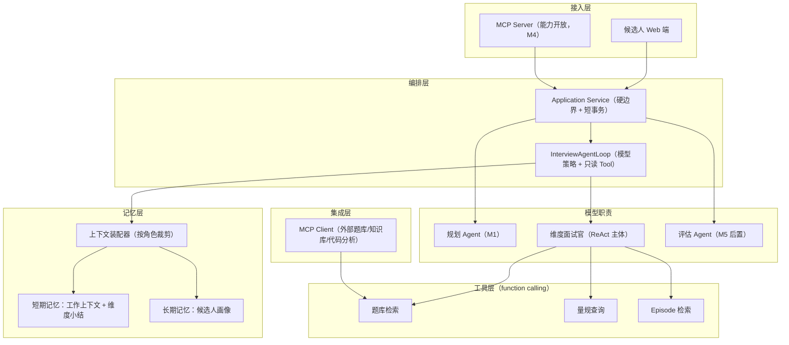
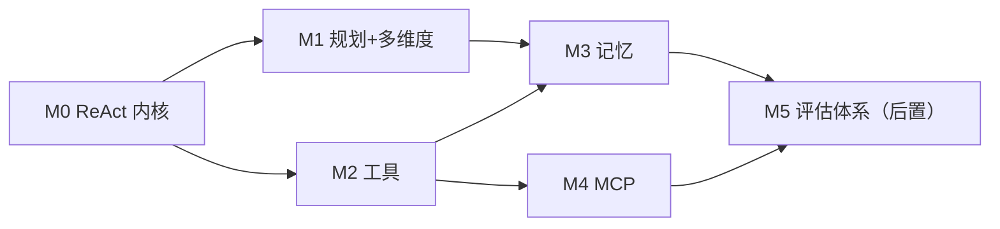

# 自适应文本面试实现设计：ReAct 内核、记忆、多 Agent 与工具/MCP

> 维护：Agent；上游设计决策以 `docs/design/` 为准。
>
> 状态：目标规格，已按 2026-08-29 Agent 控制边界校准
>
> 2026-08-12 重写：抛弃 `agent-loop-mvp-v1` 代码约束，以 [Agent 面试平台演进设计](../design/01-platform-design.md) 为准重新设计实现路径；评估体系（深度量规、证据、报告）按决策后置到最后阶段。本文取代此前"基于现有代码演进"的版本。（2026-08-22：`agent-loop-mvp-v1` 代码已删除。）
>
> 最后更新：2026-08-29
>
> Agent Loop、Tool 和 Working Memory 的详细实施边界见 [36-agent-loop-working-memory-spec.md](./36-agent-loop-working-memory-spec.md)。本文中旧的固定维度策略、通用 Role Registry、伪 Tool 和中间执行持久化设计不再有效。

## 1. 决策与前提

本文的四条输入决策（来自评审结论）：

1. **不兼容现役实现**。`agent-loop-mvp-v1`（Skill 人格 + 自由循环）作为探索归档，其实现形态不约束本设计（2026-08-22 已删除）；可复用的只有 `common/` 基础设施（`LlmProviderRegistry`、`StructuredOutputInvoker`、限流、异常体系）和"有界循环"的工程经验（deadline、步预算、乐观锁）。
2. **以平台设计为蓝本**：星型多 Agent、L0/L1/L2 三层记忆、工具客观验证、MCP 跨边界。
3. **评估后置**：深度量规、每轮评级、证据报告放在最后阶段（M5）。前序阶段的面试是"自适应出题但无结构化结论"。
4. **术语声明**："React 范式"指 **ReAct（Reasoning + Acting）**——模型每步产出"思考 + 动作"，执行后观察结果再进入下一步；不是前端 React 框架。

### 1.1 一条不可让渡的不变量（2026-08-12 已裁决确认）

> **评估可后置，用户可见事实与正式证据不可后置。**

M0 起所有已展示问题、已提交回答、正式评估、采用的 Tool provenance 和 Evidence 必须持久化为结构化记录，格式满足“M5 评估上线后可对历史会话回填评估”。一次 Agent Loop 内的模型草稿、只读 Tool 调用和 Observation 可重新计算，不是领域事实，不要求持久化。

裁决结论：不兼容 v1 任何存储格式、不做双写迁移；`agent_turns` 从 M0 起结构化为行。每轮最终 Working Memory Snapshot 可以使用明确 schema 的 JSON；完整 ReAct 轨迹、只读 ToolExecution 和未采用的草稿不落库。

## 2. 目标架构



继承平台设计的架构不变量：只有 application 的短事务可以提交领域事实；Tool executor 不直接写会话；同一份证据库生成不同报告视图。Agent 拥有面试语义策略，Java 只验证硬边界。

## 3. ReAct 循环内核（M0）

### 3.1 循环语义

只有 Interviewer 使用 Agent Loop；Planner 和 Assessor 是一次结构化模型调用。Interviewer 的一次运行是：

```text
loop:
  context  = ContextAssembler.build(sessionFacts, workingMemory)
  step     = model.nextStep(context)                     # 结构化输出：decisionSummary + action
  match step.action:
    Respond(question/finish) -> 硬边界校验后返回
    ToolCall(name, args)     -> allowlist/schema/scope 校验 -> 执行 -> observation 回给模型
    Rejected(reason)         -> 作为 observation 回给模型重新决定
  超出显式资源预算或 deadline -> 明确失败，领域状态不推进
```

设计要点：

- **结构化动作集**：`Respond`（ASK 或 FINISH）、`ToolCall`。可以保存最终采用动作的简短 `decisionSummary`，但不要求或持久化完整思维链。
- **资源边界**：deadline、token 和调用次数只防止资源失控，不决定调用哪个 Tool、选择哪个 Gap 或按什么顺序调用。
- **控制权分离**：Agent 决定 Target/Gap、追问/切换、只读 Tool 及最终问题；Java 校验权限、最大轮次、Target 属于 Plan、Tool allowlist/schema/scope 和证据真实性。Java 拒绝非法动作，但不能替 Agent 选择另一个合法动作。
- **thought 不落全文**：决策记录只保存动作 + 一句理由摘要 + 工具调用摘要，不保存完整思维链。理由：日志合规（回答内容敏感）+ 存储成本 + 完整 CoT 对重放没有增量价值（重放用的是状态和动作，不是措辞）。

### 3.2 与 Spring AI 2.0 的对接

- 模型获取：`LlmProviderRegistry.getChatClientOrDefault(provider)`；
- 结构化输出：`StructuredOutputInvoker` + `BeanOutputConverter`，不自写重试；
- Prompt：`resources/prompts/` 下按角色拆分 `.st` 模板（`planner-system.st`、`interviewer-system.st` 等）；
- function calling：M2 起用 Spring AI `ToolCallback` 注册工具，但**调用发起权仍在循环内核**——模型的 tool 请求先经编排器白名单与预算校验再执行，不直接交给框架自动循环。

## 4. 多 Agent 角色拆分

星型结构（平台设计 4.1 的论证不再重复）：角色之间不直接对话，只通过编排器传递最小上下文。

| 角色 | 阶段 | 职责 | ReAct 差异 |
|---|---|---|---|
| 规划 Agent | M1 | JD + 简历 → 不可变 Target Plan（考察范围、证据目标、Skill、硬上限） | 单次结构化调用，不进入 Agent Loop |
| 维度面试官 | M0 | 单维度内的 ReAct 主体：追问、换题建议、调工具 | 完整 ReAct 循环 |
| 评估 Agent | M5（后置） | 每轮深度评级 + Evidence/ProbeGap | 单次结构化调用，不读取 Working Memory |
| 报告措辞 | M5 后可选 | 结论 → 自然语言反馈（结论不可改写） | 单步 |

两个工程决策（沿用上一轮评审结论）：

1. Planner、Interviewer、Assessor 是三个明确的模型职责，不建立通用 `AgentRoleRegistry`、角色状态机或“未来可插拔角色平台”。各职责直接注入所需 Prompt、上下文和端口。
2. Interviewer 依据 Plan、Coverage、ProbeGap 和 Working Memory 自主决定追问、切换 Target、调用只读 Tool 或建议结束。Java 只确保选择仍在 Plan 内、总轮次不超上限，不强制固定维度顺序或最低题数。

## 5. 记忆系统

> Working Memory 以 [36-agent-loop-working-memory-spec.md](./36-agent-loop-working-memory-spec.md) 为准；Episodic/Semantic Memory 以 [34-memory-three-layer-spec.md](./34-memory-three-layer-spec.md) 为准。

### 5.1 短期记忆（会话内，M0 起步、M3 完整）

三层结构：

- **Working Memory**：当前注意力、工作假设、ProbeGap/Evidence 引用、下一步验证意图和本轮 Observation。Loop 内只驻留内存，最终 Snapshot 与下一 Turn 一次提交；不使用持久 WorkState、Patch 或 ActionIntent；
- **会话记忆**：已完成轮次（问题 + 回答原文 + 工具结果），DB 为事实源。一个已回答的 turn 就是一个事件 Episode（追问会产生新 turn，用 `parentTurnIndex` 关联）；
- **维度小结**（M3）：维度完成后把该维度问答压缩为小结（考察重点、关键发现、turnIndex 列表），后续轮次上下文中用小结替代原文。**小结只用于上下文导航，永远不作为任何结论的数据源**；压缩由独立 LLM 调用完成，编排器校验 turnIndex 存在性后入库。

上下文装配器是短期记忆的唯一出口。它从领域事实和最终 Snapshot 组装一次性上下文，并自动加载 Plan 已确定的 Skill；不得把 WorkState 投影或历史评级伪装成 Working Memory。单次调用输入 token 上限入配置，超限报错不静默截断。

### 5.2 长期记忆（跨会话，M3）

新分类下长期记忆拆为 **Episodic Memory** 与 **Semantic Memory**；具体不可变事实、模式投影和双轨画像边界以 34 号 v4 规格为准。

评估后置决定了长期记忆**分两批填充**：

- M3 即可写入（不依赖评估体系）：
  - 已考察主题清单（维度 + focus + 时间）→ 复测选题去重；
  - 候选人自述技能与项目声明（结构化抽取，标记"未验证"）；
  - 练习记录（薄弱点 → 推荐题目 → 完成状态）；
- M5 评估上线后填充：维度 × 深度等级、证据引用、成长轨迹；事件卡片的 Assessment 字段同样依赖评估结果。

写入纪律（平台设计 7.5，从 M3 第一天就强制执行，不等 M5）：

- 只有编排器裁决后写记忆，Agent 不直接写；
- 只写结构化事实和来源引用；LLM 摘要、标签只作为受限 enrichment，不能成为正式评估输入；
- Episode 事实索引随答题事务落库，摘要、标签与向量索引异步生成；
- 公平性防火墙的读侧规则同步生效：v3 的长期记忆选题链是待删除现状；v4 正式场景只允许出题后读取中性去重/重验证投影，评级字段始终与正式角色隔离。

存储：结构化部分入 PostgreSQL（`candidate_memory_*` 表）；pgvector 只做两件事——题目语义去重、历史相似问答检索（离线分析用，不进实时链路）。沿用现有 1024 维 COSINE 设施。

## 6. 工具与 function calling（M2）

工具原则不变：把主观判断替换为客观验证；内部工具走 function calling，不包 MCP。

| 能力 | 类型 | 处理方式 |
|---|---|---|
| 加载 Plan 已确定的 Skill | 上下文装配 | `ContextAssembler` 自动执行，不暴露给模型 |
| `question_bank_search` | 条件成立时的只读 Agent Tool | 只有当前产品启用真实题库检索闭环时注册；否则删除相关 index/MCP fallback |
| `rubric_search` | 只读 Agent Tool | 模型按当前语义查询相关领域和等级区分标准 |
| `rubric_get(rubricId)` | 普通读取 | 已有稳定 ID 时直接由 Java 服务读取 |
| `memory_search` | 只读 Agent Tool | 模型按当前 Gap 决定是否召回中性历史 |
| Evidence/anchor 校验 | 领域校验 | Java 自动执行，不是 Tool |
| 练习推荐 | Application Service | 面试结束后确定性聚合 |

只读 Tool 不持久化 `ToolExecution`、Intent 或幂等键；调用失败作为 Observation 返回模型。只有最终采用的结果需要以稳定 provenance 进入 Turn/Evidence。allowlist、schema、scope、deadline 和明确的结果大小限制由 `ToolGateway` 统一执行。

沙箱执行不进入通用 Tool 框架。候选人提交代码后由 Application Service 以稳定业务键创建或复用 `SandboxExecution`，异步结果成为 Evidence；模型只能读取已完成的事实。

## 7. MCP 实现（M4）

### 7.1 作为 MCP 客户端

第一批接入（按价值排序）：

1. **外部题库/知识库服务**：`question_bank_search` 的远端实现走 MCP——题库独立部署、独立迭代，平台只认 MCP 工具契约；这是为后续企业集成 dogfooding MCP 客户端链路的最低成本场景；
2. **项目代码分析服务**（Pi SDK 方案，见专项设计文档）：接口预留，实际接入仍排在评估体系之后——没有评估闭环，代码事实进不了结论，早接只是摆设。

技术选型：Spring AI MCP Client（`spring-ai-starter-mcp-client`）。只有经过显式 allowlist 的只读能力才能注册进 `ToolGateway`。远端超时或错误作为明确 Observation 返回模型；没有产品批准的本地等价实现时，不做静默 fallback。

### 7.2 作为 MCP 服务端

暴露平台能力给企业/外部 Agent（Spring AI MCP Server）：

- M4 暴露：`interview.create`、`interview.submit_answer`、`interview.get_status`、`interview.list_dimensions`；
- M5 后暴露：`interview.get_report`（报告依赖评估体系）；
- 治理（平台设计 6.2）：租户凭证、scope、审计、404 而非 403 的跨租户姿势——M4 第一天就带租户模型，不然后补是破坏性变更。

## 8. 数据模型

M0 的最小集合（全部新表，与 v1 的 `agent_interview_sessions` 无迁移关系，v1 数据只读归档）：

```text
agent_sessions              会话（runtime_version、jd、resume、状态、版本号）
agent_turns                 轮次（问题、回答原文、采用的 provenance、决策摘要）★ M5 回填评估的载体
agent_plans                 不可变考察计划（M1：Target、focus、Skill、硬上限）
dimension_briefs            维度小结（M3）
candidate_memory_topics     长期：已考察主题（M3）
candidate_memory_claims     长期：候选人自述声明（M3，标记未验证）
practice_records            长期：练习记录（M3）
-- M5 追加：
agent_assessments           评估结果（轮次 × 维度 → 深度等级）
agent_evidences             证据（QUOTE / TOOL_RESULT）
```

`agent_turns` 从 M0 起就是完整结构化记录（不是 JSON 大字段）——这是"证据不可后置"在 schema 上的落地。与平台设计第 8 节的关系：本文是 M0~M5 视角的最小集，企业聚合所需的扩展（tenants 等）仍在平台文档，不重复。

## 9. 分阶段实施计划

| 阶段 | 交付 | 出口验收 |
|---|---|---|
| M0 | 单次 interviewer 调用 + 领域事实短事务：`agent_turns` 完整落库、基础页面 | 可完成动态面试；LLM 失败不推进事实 |
| M1 | Planner + 多 Target Plan + Coverage 投影 + 模型策略选择 | Agent 可在合法 Target 中切换；任何路径不突破最大轮次 |
| M2 | 最小 Agent Loop + 首个 `rubric_search`；题库/记忆仅在真实需求启用时接入 | Tool Observation 确实回流模型；固定 Skill 不产生 ToolCall；只读调用不落执行表 |
| M3 | Working Memory Snapshot + Episodic/Semantic 记忆边界 | Snapshot 不复制领域事实；崩溃后从最近事实重跑；历史评级不进入正式评估 |
| M4 | MCP：客户端接外部只读能力 + 服务端开放 create/status + 租户模型 | 远端失败显式可见；跨租户请求 404 |
| M5 | 评估体系：评估 Agent、L0~L4 量规、证据校验、确定性报告、公平性防火墙全量启用、历史会话回填评估 | 证据可追溯率 100%；评级一致性回归通过；M0~M4 老会话可回填 |



M1 与 M2 可并行；M5 只硬依赖 M3（记忆写入纪律与画像 schema 必须先对）。

## 10. 现有代码处置

- 旧 MVP 已删除；当前 `adaptive` 包是唯一需要原地简化的生产实现，不再创建第二套 runtime 或长期 feature flag；
- 按 36 号规格逐切片迁移消费者后，立即删除对应 WorkState/Intent/Role/伪 Tool 路径，不双写、不保留 compatibility adapter；
- 可保留的经验只有显式 deadline、单问题输出契约、Skill 内容 hash 和已证明必要的数据库并发守护；具体旧类不构成保留理由。

## 11. 主要失败场景与对策

**场景一：ReAct 循环空转烧 token。**
模型反复调用工具不产出 Respond。对策：使用显式 deadline/token/调用资源预算；预算耗尽明确失败且事实不推进。重复查询可以作为诊断信号，但不能仅因参数相同就假定非法。测试：桩模型死循环响应，验证资源边界与状态完整。

**场景二：评估后置期间数据格式漂移，M5 无法回填。**
M0~M4 期间有人"优化" `agent_turns` 结构（比如把回答截断存摘要），M5 回填时原文不全。对策：`agent_turns` 的写入路径只有一条（编排器持久化服务），结构变更必须过评审；CI 加一个 schema 守护测试：轮次记录必须含完整问题/回答原文字段。这是 1.1 节不变量的可执行形式。

**场景三：长期记忆在评估缺位时被误用为评级。**
M3 画像里有"已考察主题"，有人顺手拿"考察过=会了"做展示。对策：画像 schema 中评级字段 M5 前物理不存在（不是"先留空"），`candidate_memory_claims` 恒带"未验证"标记；前端候选人视图 M5 前不展示任何能力结论，只展示练习与覆盖记录。

**场景四：MCP 远端题库故障拖死面试。**
对策：MCP 工具有明确超时，失败作为 Observation 返回 Agent 选择继续、改查其他已注册 Tool 或显式失败；禁止基础设施层静默切换数据源或伪造未审核题。测试：远端黑洞时在 deadline 内暴露明确结果，且不写入伪 provenance。

**场景五：多角色 Prompt 各自漂移。**
面试官、规划、评估的 Prompt 分开维护后，量规口径在三处出现三个版本。对策：量规与术语定义只存一份（`prompts/shared/` 片段，各角色模板 include）；改量规必须全角色回归。

## 12. 指标

- M0 起：每场面试 LLM 调用次数、token、工具调用分布（商业模型输入）；
- M3 起：单轮输入 token 有界性、画像写入合法率（只允许结构化值，目标 100%）；
- M4 起：MCP 工具成功率、显式失败率和 Observation 后的 Agent 决策分布；
- M5 起：证据可追溯率（100%）、评级一致性、追问收益比——M0~M4 的调用数据是 M5 量规校准的训练集。

## 13. 与既有文档的关系

- 平台设计文档：本文是其 M0~M5 落地视角，架构不变量全部继承；路线图以本文为准，平台文档第 11 节相应让位（保留为长期愿景视图）；
- 代码分析专项设计：MCP 客户端预留其接口，接入排在 M5 后；
- 实施模块拆分：[Agent 重实现实施模块与交付切片](./20-implementation-modules.md) 将本文阶段映射为稳定代码边界与可验收纵切；实施顺序以本文 M0~M5 为准，package 不按阶段命名；
- v1 相关文档（MVP 设计/实施计划）：均已标记历史，不再更新。
