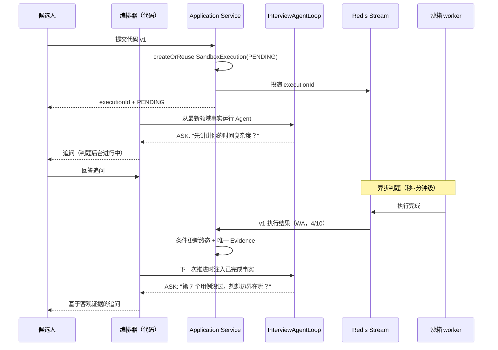

# 算法题面试设计：代码沙箱与延迟执行

> 维护：Agent；上游设计决策以 `docs/design/` 为准。
>
> 状态：目标规格，已按 2026-08-29 Agent 控制边界校准
>
> 前置文档：[Agent 面试平台演进设计](../design/01-platform-design.md)（§5.3 沙箱 P0 设计）、[Agent Loop 与 Working Memory 规格](./36-agent-loop-working-memory-spec.md)
>
> 最后更新：2026-08-29

## 1. 定位与前提

本文激活平台设计中"Phase 2：代码沙箱 + 算法维度"的落地路径，把它从"推迟"状态拉回演进主线。三件事先钉死：

1. **沙箱执行是领域副作用，不是 Agent Tool**。候选人提交代码后，Application Service 创建或复用 `SandboxExecution`；模型没有必要决定是否提交，也不能修改由业务事实确定的参数。
2. **`SandboxExecution` 是唯一执行事实源**。执行请求、状态和结果从第一天完整落库，重投复用同一个稳定业务键，不再复制为 ActionIntent、ToolExecution 或 ToolResultEvent 状态。
3. **延迟执行是一等业务语义**。代码判题天然秒级到分钟级，候选人可以继续对话；结果完成后作为新领域事实进入下一次标准 Agent Loop，不给 Loop 增加挂起/恢复生命周期。

### 1.1 核心设计判断

三个贯穿全文的主张：

1. **提交是 Application Command**。用户提交代码本身已确定要执行沙箱；参数来自 Session、Turn、Problem、代码 hash 和 run mode，不通过 function calling 再让模型确认一次。
2. **延迟执行 = 提交即返回句柄 + 事实完成后重新组装 Context**。Agent Loop 不等待、不轮询，也不保存 Pending Tool 状态。
3. **判题结果分为"候选人的事实"和"系统的事故"**。AC/WA/CE/TLE/MLE/RE 是候选人的客观事实，可作为证据；IE（沙箱内部错误）是平台事故，**不得作为任何负面证据**，必须支持重判与后补。

## 2. 延迟执行语义（本文核心）

### 2.1 为什么不是同步调用

朴素方案：面试官发起 `ToolCall(run_code)`，内核同步阻塞等沙箱返回，再把 observation 喂回模型。它会失败在三个地方：

1. **有界循环被打破**。单轮 deadline（30s 级）对 LLM 合理，对判题不合理（排队 + 编译 + 跑用例，P99 必然超标）；把 deadline 放宽到分钟级，则"死循环烧 token"的防护同时失效。
2. **候选人体验锁死**。同步等待期间面试界面只能转圈——算法面试偏偏是最需要"边等边聊"的场景（让候选人口述复杂度分析、边界处理，恰是判题结果之外的关键证据）。
3. **事务与资源纪律被破坏**。长阻塞把虚拟线程、HTTP 连接、LLM 上下文一起吊住，违反"LLM/外部调用不在事务内"的既有纪律。

**结论**：执行请求与执行结果解耦，中间用 Redis Stream 传递——这正是仓库已有的 `AbstractStreamProducer` / `AbstractStreamConsumer` 模板的标准用法，不引入新中间件。

### 2.2 协议：应用提交 + 执行事实

候选人提交代码时，应用服务执行一个明确命令：

| 命令 | 调用者 | 语义 | 返回 |
|---|---|---|---|
| `submitCode(sessionId, turnIndex, problemId, codeRef, codeHash, runMode)` | HTTP/Application | 创建或复用执行，立即返回 | `{executionId, status: PENDING}` |

`run_mode` 两档：

- `SAMPLE`：只跑公开样例（≤3 条），秒级返回，供"先跑个样例看看"的轻量验证——仍然异步，只是优先级高、超时短；
- `FULL`：完整测试集判题，正常排队。

不向模型提供 `sandbox_submit` 或 `sandbox_result`。页面可以按 executionId 查询进度；Agent 只在下一次 Context 中读取已经完成或明确失败的 `SandboxExecution` 事实。

执行链：

```text
候选人提交代码
  -> Application 校验归属、配额、题目/代码引用
  -> 使用稳定业务键 createOrReuse SandboxExecution(PENDING)
  -> 事务提交后投递同一 executionId 到 Redis Stream
  -> 沙箱 worker 隔离执行
  -> 一个短事务条件更新 SandboxExecution 终态并写入唯一 Evidence/consumedAt
  -> 下一次正常面试推进读取最新 Turn/Assessment/Evidence/SandboxExecution
  -> ContextAssembler 组装事实，InterviewAgentLoop 自主决定是否围绕结果追问
```

三个必须由代码保证的边界：

- **提交正确性**：每场会话的显式执行配额继续作为资源边界；`sessionId + turnIndex + problemId + codeHash + runMode` 形成稳定业务键，HTTP 重放和 Stream 重投复用同一 executionId；新代码 hash 是新的业务提交，不用时间窗猜测是否重复；
- **时效裁决**：结果到达时若所属代码已被更新版本覆盖，老结果照常落库标记 `superseded`，但 Coverage/Context 不把它当作当前版本 Evidence；
- **超时事实**：队列积压或沙箱不可用超过明确阈值时，条件更新为 `TIMEOUT_QUEUED`。该状态不作为负面证据；是否继续代码走读由 Agent 基于显式 Observation 决定，不由 Java 静默切换策略。

### 2.3 时序图



关键性质：候选人感知到的只有"提交 → 继续聊 → 面试官拿到结果后继续聊"，**等待时间被面试对话本身填满**。这是延迟执行的业务价值，不只是工程解耦。

### 2.4 对 Agent Loop 的影响

沙箱不改变 Agent Loop 协议。Loop 仍只执行请求内可完成的 0..N 个只读 Tool，然后输出 ASK 或 FINISH。沙箱结果由 application 写成领域事实；下一次 Loop 与处理普通新回答一样，从最新事实重新组装 Context。执行等待时间不属于模型调用 deadline。

## 3. 沙箱服务边界与安全

沙箱是独立服务（`sandboxd`），通过内部 API 消费 Redis Stream 任务，**不嵌入面试服务进程**（平台设计 §5.3 不变）。

### 3.1 安全要求（不可妥协）

- 容器级隔离（gVisor/runsc 优先），每次执行独立容器或从预热池取用后销毁复用；
- **无网络访问**、只读根文件系统、可写目录限 tmpfs 且配额化；
- seccomp 白名单系统调用；禁止 fork 炸弹（PID 数上限）；
- CPU / 内存 / 墙钟时间硬限制（默认 2s CPU、256MB、10s 墙钟，按题目可配）；
- 源码大小上限（64KB）、单用例输出截断（64KB）、总输出截断；
- 每场会话执行次数上限（见 2.2 配额裁决）——防"把面试平台当免费算力"；
- 执行日志（编译输出、用例结果、资源消耗）完整留存——日志本身就是证据。

### 3.2 判题契约

```text
verdict: AC | WA | CE | TLE | MLE | RE | IE
```

- `AC/WA/CE/TLE/MLE/RE`：候选人代码的客观事实，可作证据；
- `IE`：沙箱自身故障，**不计入候选人负面证据**。沙箱执行层是该失败的唯一 retry owner；重投复用同一 executionId 和稳定业务键，最终失败显式保留；
- 结果摘要：通过用例数/总数、最长耗时、峰值内存、首个失败用例编号（**不含隐藏用例内容**——用例是平台资产，泄漏等于题库泄露）。

### 3.3 语言与题目

- 首发语言：Java、Python、C++（镜像各一，版本锁定写入配置）；
- 题目来源可以是审核题库或 Agent 基于合法上下文生成；最终 Turn 必须明确记录来源 provenance，不能在题库失败时由基础设施静默伪装成另一来源；
- 测试用例分公开（SAMPLE 可见）与隐藏（FULL 专用），隐藏用例内容**永不进入任何 LLM 上下文**——面试官只看到"用例 #7 失败"，不知道 #7 是什么，防止模型把用例泄露给候选人。

## 4. 数据模型增量

全部新表，与文本面试 M0 的表无迁移关系：

```text
algorithm_problems          算法题（题干、难度、标签、公开/隐藏用例引用、embedding）
sandbox_executions          执行记录 ★ 本设计的"证据不可后置"载体
  - id / session_id / turn_id / submission_seq      归属（turn_id 绑定出题轮次）
  - problem_id / language / code_ref / code_hash    代码存 S3，库内只存引用+哈希
  - run_mode / verdict / passed / total
  - time_ms / memory_kb / first_failed_case
  - status: PENDING/RUNNING/DONE/TIMEOUT_QUEUED
  - superseded_by                                 被更新提交覆盖时标记
  - created_at / finished_at
sandbox_execution_logs      执行日志引用（编译输出、用例明细，大字段存 S3）
```

纪律与 `agent_turns` 相同：写入路径唯一（编排器持久化服务 + Stream 消费者结果落库），源码原文不截断、不摘要——M5 评估上线后要能回答"这位候选人当时到底写了什么"。

`evidences` 表保存对 `sandbox_executions.id` 的稳定引用；不再通过通用 ToolResultEvent 搬运或复制执行状态。

## 5. 与既有模块的对接清单

| 对接点 | 改动 | 性质 |
|---|---|---|
| Agent Loop | 无协议扩展；只读取已提交的 SandboxExecution/Evidence 事实 | 保持最小 |
| Application | 新增沙箱提交与结果接受用例 | 领域副作用边界 |
| Stream 模板 | `AbstractStreamProducer`/`Consumer` 各实现一份判题管道 | 复用，不改模板 |
| 限流 | `@RateLimit` 加执行提交维度（会话级 + 用户级） | 复用注解 |
| 存储 | 源码与日志大字段走 RustFS/S3，库内只存引用 | 沿用现有 S3 设施 |
| 前端 | 代码编辑器组件 + 提交状态轮询（前端轮询无害，有害的是模型轮询） | 新增页面组件 |
| 记忆 | M3 起 `candidate_memory_topics` 记录"已考察算法题 ID"，复测去重 | 沿用写入纪律 |

异步纪律沿用既有规则：消费者处理前先校验会话/轮次仍存在，已删除则 ACK 丢弃；LLM 调用与沙箱调用均不在事务内。

## 6. 分阶段实施计划

依赖关系：A0 依赖 Session/Turn 事实模型和 application 短事务，不依赖 Agent Tool 框架；A3 依赖评估体系。

| 阶段 | 交付 | 出口验收 |
|---|---|---|
| A0 | 判题流水线纵向打通：应用提交 → SandboxExecution → Stream → 沙箱 worker → 终态/Evidence、最简前端提交 | 同一稳定业务提交只产生一个 execution；结果完整可追溯；配额超限被拒 |
| A1 | 最新沙箱事实进入标准 Agent Context；处理 superseded 和超时事实 | 桩沙箱延迟 5 分钟不阻塞面试；v2 提交后 v1 结果不污染当前上下文；超时不成为负面证据 |
| A2 | 题库变体与防背诵、隐藏用例治理、执行配额与滥用监控、指标看板 | 同题变体检索可用；隐藏用例不出现在任何 LLM 调用日志中 |
| A3 | 判题证据进评估：`TOOL_RESULT` 证据类型启用，算法维度评级必须引用执行结果 | 算法维度工具证据占比 100%；历史 A0~A2 会话可回填评估 |

## 7. 主要失败场景与对策

**场景一：同一业务提交重复创建沙箱副作用。**
症状：HTTP 重放、Stream 重投或并发点击为同一代码版本创建多个 execution。对策：稳定业务键 `sessionId + turnIndex + problemId + codeHash + runMode` 加数据库唯一约束；生产者和 worker 始终复用同一 executionId。测试：并发请求和消息重投后只有一个 SandboxExecution。

**场景二：结果迟到且代码已过期，面试官对错版本追问。**
症状：候选人提交 v1 后又改出 v2，v1 的 WA 结果迟到，Agent 却拿 v1 的失败追问 v2。对策：`sandbox_executions` 绑定 `submission_seq` + `code_hash`，过期结果落库标记 `superseded`；CoverageProjector 不把它作为当前版本 Evidence。测试：v1 判题中提交 v2，v1 结果到达后 AgentContext 不含 v1 结果。

**场景三：沙箱故障/积压拖死算法维度。**
症状：队列积压导致执行无法及时形成 Evidence。对策：超过已配置的显式阈值后记录 `TIMEOUT_QUEUED`，把“判题不可用”作为事实交给 Agent；Agent 自己决定代码走读、切换或结束，Java 不静默切换策略。测试：沙箱黑洞时状态明确可见、无负面 Evidence、Agent 能看到该 Observation。

**场景四：候选人滥用执行配额或攻击沙箱。**
症状：死循环提交烧资源；代码尝试网络外联、读文件、fork 炸弹。对策：会话级执行次数上限 + `@RateLimit` 提交限流 + §3.1 隔离清单；异常行为进审计日志。测试：配额第 21 次提交被拒；含 `socket.connect` 的代码在无网络容器内 RE 且平台无出站连接。

## 8. 指标

- A0 起：判题端到端延迟分布（提交→结果落库）、队列深度、IE 率（目标 <1%）、配额命中率；
- A1 起：timeout/IE 率、结果有效率（非 superseded 占比）、Agent 在不可用 Observation 后的决策分布；
- A3 起：算法维度工具证据占比（目标 100%）、判题结果与追问评级的一致性（校准用，WA 却被评 L3+ 需要人工复核）。

## 9. 与既有文档的关系

- 平台设计 §5.3：本文是其实现路径的细化与激活，安全要求与证据定位全部继承；
- Agent Loop 规格：本文明确沙箱不进入只读 `ToolGateway`，只通过 Application Service 与领域事实接入；
- 项目代码分析专项设计（MCP Pi SDK）：边界不变——那是**分析候选人既有项目代码**的只读工具，本文是**执行候选人现场编写代码**的沙箱工具，两者数据源、安全模型、证据语义均不同，不合并；
- 平台设计 §11 路线图中"Phase 2 已推迟"的注记，待本文评审通过后更新为 A0~A3 计划。
