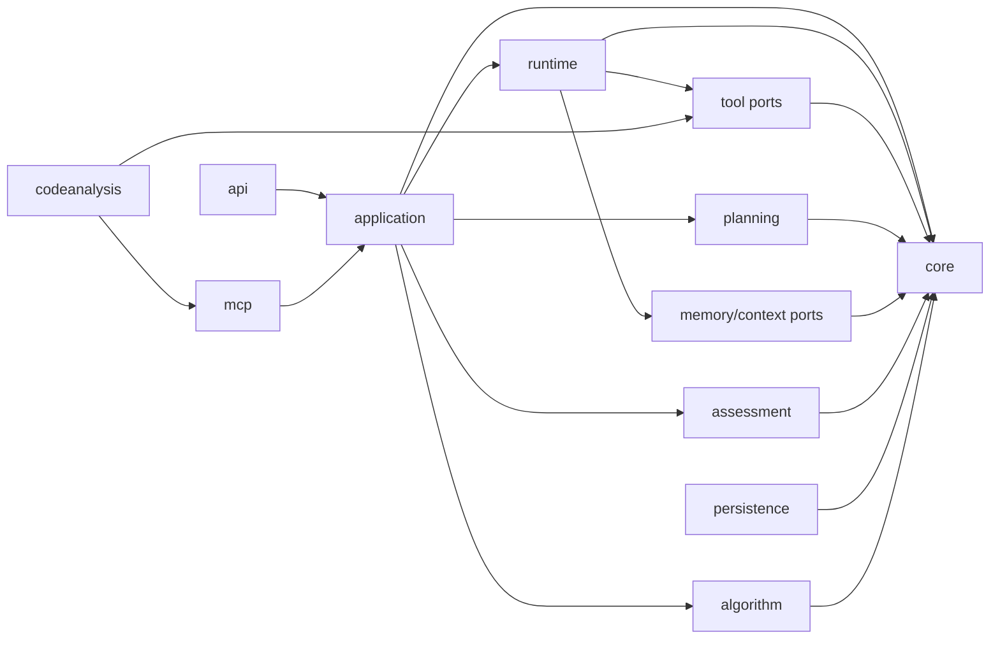

# Agent 重实现实施模块与交付切片

> 维护：Agent；上游设计决策以 `docs/design/` 为准。
>
> 状态：实施基线，已按 2026-08-29 Agent 控制边界校准
>
> 权威输入：[平台演进设计](../design/01-platform-design.md)、[Agent Loop 与 Working Memory 规格](./36-agent-loop-working-memory-spec.md)、[算法题面试设计](./11-algorithm-interview.md)、[代码分析服务设计](./12-code-analysis-service.md)
>
> 最后更新：2026-08-29

## 1. 文档目的

本文把设计文档中的 M0～M5、A0～A3、CA-1～CA-4 转换为可独立实现、可独立验收、依赖明确的工程模块与交付切片。

这里的“阶段”和“模块”含义不同：

- **阶段**描述能力按什么顺序解锁，例如 M0 先建立 ReAct 内核，M5 最后启用评估；
- **模块**描述长期稳定的责任与依赖边界，例如 `core` 永远负责状态规则，`assessment` 永远负责评估与证据；
- 一个阶段可以激活多个模块，一个模块也可能被多个阶段逐步扩展；
- 禁止创建 `m0/`、`m1/` 这类阶段包。阶段结束后它们没有业务语义，还会迫使后续阶段跨包改写同一职责。

当前唯一实施主线是 M0 → M5。算法面试和代码分析是挂接到主线的专项能力，不得复制编排器、工具网关、证据库或评估体系。

## 2. 必须保持的业务不变量

模块拆分首先服务于正确性，而不是目录整齐。以下规则从第一批代码起就必须可执行：

1. **语义策略归 Agent，硬边界归 Java**：Agent 选择 Target/Gap、追问或切换、只读 Tool、ASK/FINISH；Java 只校验权限、会话合法性、最大轮次、Plan 成员关系、Tool 安全边界、证据 provenance 和数据完整性。
2. **编排器是唯一状态修改者**：Controller、Agent、工具、MCP 适配器都不能直接推进会话状态。
3. **评估可后置，用户可见事实和证据不可后置**：完整保存已展示问题、回答、正式评估、Evidence 和采用的 provenance；模型草稿、只读 Tool 调用与 Observation 不成为恢复状态。
4. **外部调用不进入事务**：LLM、MCP、S3、HTTP 和沙箱调用在事务外执行；持久化由短事务命令完成。
5. **同一事实源，多种投影视图**：候选人报告和企业报告只能投影同一组 assessment/evidence，不能各自生成结论。
6. **不可信输入不能越权成为指令或证据**：JD、简历、回答和代码仓库都是数据；简历主张和代码分析产物不能直接变成能力结论。
7. **旧 MVP 已删除**：`agent-loop-mvp-v1` 已于 2026-08-22 删除；只保留其 deadline、单问题校验、skill hash、乐观锁四项工程经验。

## 3. 代码边界

### 3.1 根包与隔离策略

新实现统一放在：

```text
interview.guide.modules.interview.agent.adaptive
```

`adaptive` 表达业务能力“自适应 Agent 面试”，不是临时版本号。旧 MVP 的根级 `runtime/`、`tool/`、`model/` 已于 2026-08-22 删除。

第一阶段仍保留在现有 Gradle `:app` 模块内，以 package 边界和架构测试约束依赖。此时直接拆成多个 Gradle 子模块会增加 Spring 扫描、测试夹具、迁移脚本和配置装配成本，却还没有独立部署收益。真正需要独立扩缩容和安全边界的沙箱服务、代码分析服务从一开始就是独立部署单元。

### 3.2 稳定模块

| 模块 | 建议包 | 唯一责任 | 允许依赖 | 首次激活 |
|---|---|---|---|---|
| 接入 | `adaptive.api` | HTTP 路由、请求校验、DTO/Response 映射、限流 | `application` | M0 |
| 应用编排 | `adaptive.application` | create/answer/sandbox-result 用例；组织“读取事实 → 外部调用 → 硬边界校验 → 短事务落库” | `core`、`runtime`、各能力端口 | M0 |
| 领域内核 | `adaptive.core` | Session/Turn/Plan 等事实、Coverage 投影和必须确定性的业务不变量 | 无 Spring AI/JPA/HTTP 依赖 | M0 |
| Agent 运行时 | `adaptive.runtime` | `InterviewAgentLoop`、模型端口、0..N 只读 Tool/Observation 循环、资源 deadline | `core`、`tool` 和上下文端口 | M0 |
| 持久化 | `adaptive.persistence` | 按领域事实组织 Entity/Repository/短事务命令、必要的 unique/条件更新/乐观锁 | `core`、各能力的 port/model | M0 |
| 规划 | `adaptive.planning` | JD + 简历 → 不可变 Target Plan；规划模型与 taxonomy 硬校验 | `core`、`common.ai`、自身存储端口 | M1 |
| 工具 | `adaptive.tool` | 只读 Tool SPI、ToolGateway、allowlist/schema/scope/provenance/deadline 和适配器 | `core`、`runtime` 端口 | M2 |
| 记忆与上下文 | `adaptive.memory` | ContextAssembler、Working Memory Snapshot、Episode/Semantic 召回和公平性读写边界 | `core`、自身存储端口 | M3 |
| MCP 集成 | `adaptive.mcp` | MCP Client 适配器、MCP Server 接入、租户/scope/审计边界 | `application`、`tool` 端口 | M4 |
| 评估与报告 | `adaptive.assessment` | 深度量规、评估 Agent、证据校验、确定性报告、历史回填 | `core`、自身只读端口 | M5 |
| 算法面试 | `adaptive.algorithm` | 题目、Application 提交、SandboxExecution、异步判题和沙箱 Evidence | `application`、`core` 端口 | A0～A3 |
| 代码分析接入 | `adaptive.codeanalysis` | 仓库任务、结构化产物、锚点校验、普通读取与 `code.trace` Tool 适配 | `mcp`、`tool`、`planning` 端口 | CA-1～CA-4 |
| 可观测性 | `adaptive.observability` | 指标、审计字段、trace 关联；不得记录回答/代码等敏感原文 | 各模块发布的稳定事件 | M0 起 |

大文件量模块内部按职责划二级子包（2026-08-16 落地，纯机械移动，不改变顶层依赖方向）：

| 顶层模块 | 二级子包 |
|---|---|
| `core` | `session`（会话/轮次硬边界）、`context`（Coverage 与领域值对象） |
| `runtime` | `loop`（Agent Loop/Decision/Observation）、`validation`（最终提案硬边界校验） |
| `memory` | `working`（Snapshot）、`episodic`、`semantic`；`ContextAssembler` 留根包 |
| `persistence` | `session`、`plan`、`memory`、`assessment`、`practice`、`algorithm`，按 §4 数据所有权分组 |
| `assessment` | `depth`（深度评估）、`evidence`（证据校验）、`report`（双视图报告）、`practice`（练习推荐）、`backfill`（历史回填） |
| `algorithm` | `problem`（题目选题）、`sandbox`（沙箱协议）、`judge`（异步判题流）、`evidence`（沙箱证据）；`api` 原有 |
| `codeanalysis` | `job`（任务生命周期）、`repo`（仓库快照）、`claim`（主张核验）、`scenario`（场景卡）、`trace`（调用链）；入口服务留根包 |

注意：`persistence.memory.CandidateMemoryClaimStatus`（候选人记忆 claim 状态，仅 `UNVERIFIED`）与 `codeanalysis.claim.ClaimVerificationStatus`（代码事实核验状态）是两个不同概念，不要混用。

### 3.3 依赖方向



约束：

- `core` 不依赖 Spring AI、JPA、Redis、S3、MCP 或 Web；它只验证领域合法性和硬边界，不编码 Gap/Target/Tool 策略。
- `runtime` 不调用 Repository；它消费不可变 AgentContext，并把 Tool Observation 回流模型，直到得到 ASK/FINISH 或明确失败。
- `persistence` 不决定下一动作；它只保存最终领域事实和 Turn 边界的 Working Memory Snapshot。
- 存储端口由需要数据的业务模块拥有（例如 `memory.port.MemoryStore`），`persistence` 提供实现；业务模块不得 import Entity 或 Repository。
- `assessment` 不读取会影响公平性的候选人历史评级；长期记忆可影响选题，不影响同一回答的评级。
- `algorithm` 和 `codeanalysis` 只能通过稳定端口接入主线，不能各自创建第二个 Agent loop。

## 4. 持久化所有权

“M5 能否回填 M0 历史会话”的答案取决于持久化模块是否从第一天稳定。表按事实类型归属：

| 所有者 | 表/记录 | 首次建立 | 关键守护 |
|---|---|---|---|
| `persistence` | `agent_sessions` | M0 | owner、状态、maxTurns、一个 `@Version` |
| `persistence` | `agent_turns` | M0 | 问题/回答原文不截断；一轮一行；可定位原始顺序 |
| `persistence` | 最终 AgentDecision 摘要 | M0 | 不存完整 CoT、逐步模型动作或只读 ToolExecution |
| `planning` | `agent_plans` | M1 | 不可变 Target、focus、Skill 和硬上限；不存运行状态 |
| `memory` | Turn Snapshot、Episode/Semantic facts | M3 | Snapshot 只含引用与临时认知；不作为报告事实源 |
| `assessment` | `agent_assessments`、`agent_evidences` | M5 | quote 原文子串；报告只引用已验证证据 |
| `algorithm` | `algorithm_problems`、`sandbox_executions`、日志引用 | A0 | submissionSeq/codeHash；IE 非负面证据；迟到结果可识别 |
| `codeanalysis` | repo/job/digest/claim/scenario | CA-1 | commitHash、稳定 ID、真实 file:line 锚点、保留期 |

所有写入通过 application 调用对应的短事务服务，禁止 Agent、Controller、只读 Tool executor 或 Stream producer 直接写业务状态。Stream consumer 只条件更新自己的 SandboxExecution/AnalysisJob 事实；后续 Agent Loop 从最新事实重新组装，不维护通用唤醒状态机。

## 5. 主线实施切片

### 5.1 M0：领域事实与最小 Agent Loop 纵切

M0 不按“先写完所有 Entity，再写完所有 Service”的横向方式推进，而按可运行纵切拆分：

| 切片 | 交付 | 主要模块 | 出口验收 |
|---|---|---|---|
| M0.0 边界守护 | `adaptive` 根包和依赖测试 | core/test | 只有一条生产运行路径，不保留旧 runtime feature flag |
| M0.1 领域契约 | Session/Turn/Plan、CoverageView、AgentDecision 和硬边界 | core | 非法 Session/Turn、Plan 外 Target 和超最大轮次由纯单测拒绝 |
| M0.2 事实落库 | `agent_sessions`、`agent_turns`、最终决策摘要、Snapshot、短事务写入服务 | persistence | 完整问题/回答可重读；没有 Loop 中间执行表 |
| M0.3 Agent 运行时 | model port、Agent loop、Observation、step/tool/deadline 资源预算 | runtime | Tool Observation 回流模型；超时和模型失败不推进事实 |
| M0.4 应用纵切 | 创建会话、生成首题、提交回答、生成下一题/结束、稳定业务键与并发守护 | application/api | 动态面试可完成；并发提交只有一个合法推进 |
| M0.5 可观测与回归 | 调用次数/耗时/token、动作审计、黄金场景与失败回归 | observability/test | 能定位一次失败停在哪个输入、动作和状态；日志无回答原文 |

M0 的完成定义不是“接口能返回下一题”，而是：外部失败不会推进状态、重复/并发提交不会多走一轮、每个已完成轮次都保留未来评估所需事实。

### 5.2 M1～M5

| 阶段 | 实施切片 | 激活模块 | 硬依赖 | 出口验收 |
|---|---|---|---|---|
| M1 | M1.1 不可变 Plan；M1.2 规划模型；M1.3 CoverageProjector | planning/core | M0 | 模型可选择非顺序 Target；Plan 外选择被拒；规划失败不建会话 |
| M2 | M2.1 只读 Tool SPI；M2.2 allowlist/schema/scope；M2.3 首个 rubric search | tool/runtime | M0；可与 M1 并行 | Tool→Observation→模型→ASK 真循环；固定 Skill 不产生 ToolCall；未启用能力无平台骨架 |
| M3 | M3.1 ContextAssembler；M3.2 Working Memory Snapshot；M3.3 Episode/Semantic；M3.4 公平性 | memory/persistence | M1 + M2 | Snapshot 不复制领域事实；崩溃从事实重跑；回答注入不污染长期画像 |
| M4 | M4.1 MCP Client 只读适配；M4.2 tenant/scope/audit；M4.3 create/status Server | mcp/tool/application | M2 | 远端错误作为明确 Observation；跨租户资源返回 404 |
| M5 | M5.1 L0～L4 量规；M5.2 评估 Agent；M5.3 quote/tool 证据校验；M5.4 确定性双视图报告；M5.5 历史回填 | assessment/persistence/memory | M3；M4 非硬依赖 | 证据可追溯率 100%；相同回答不受历史画像影响；M0～M4 会话可回填 |

主线依赖允许的并行关系只有：M1 与 M2 在 M0 完成后并行。M3 必须等待两者；M5 只硬依赖 M3，不能因 MCP 延后而阻塞评估闭环。

## 6. 专项能力挂接

### 6.1 算法面试 A0～A3

算法能力不是 Agent Tool 协议扩展，而是 application 下的独立副作用链：

| 阶段 | 模块改动 | 前置 |
|---|---|---|
| A0 | `algorithm` 打通 problem → Application submit → SandboxExecution → Stream → worker → 终态 | M0 |
| A1 | 终态与唯一 Evidence 原子消费；标准 Agent Context 读取结果；实现 superseded/timeout 事实 | A0 |
| A2 | 题目变体、隐藏用例隔离、执行配额、滥用监控 | A1 |
| A3 | `assessment` 引用 `SandboxExecution` Evidence，算法评级必须可追溯到执行结果 | A2 + M5 |

Agent Loop 不增加 Pending 或 ToolResult 事件类型。等待发生在 Loop 之外，结果成为领域事实，后续普通推进读取它。

### 6.2 代码分析 CA-1～CA-4

代码分析处理候选人既有仓库，算法沙箱执行候选人现场代码；两者安全模型、证据语义和部署边界不同，禁止合并。

| 阶段 | 模块改动 | 前置 |
|---|---|---|
| CA-1 | 独立分析服务、异步任务、MCP 薄协议、digest/claim/scenario 存储 | M4 + A0 + M5；按专项设计在评估闭环稳定后启用 |
| CA-2 | ContextAssembler 普通读取 digest/claim/scenario；按需 `code.trace` Tool；锚点校验 | CA-1 + M1 + M5 |
| CA-3 | PATCH 场景接入算法沙箱，执行结果回到统一证据链 | CA-2 + A3 |
| CA-4 | Prompt 注入、超大仓库、显式超时失败、保留期与成本治理 | 与 CA-1～CA-3 同步加固，最终独立验收 |

`CONTRADICTED` 只能触发核验问题，不能直接产生负面评估；`CODE_FACT` 只能说明问题来源或主张核验，能力结论仍来自候选人回答与实操结果。

## 7. 三个优先失败场景

### 7.1 LLM 成功，落库冲突

朴素方案在 LLM 返回下一题后直接覆盖会话 JSON。两个并发回答都可能调用模型并各自写入，表现为跳轮、重复题或回答绑定错问题。

防线：输入带 expectedTurn/version；`core` 裁决合法转换；`persistence` 用 `@Version` 或条件更新；冲突方不追加新 turn。测试用两个线程提交同一轮回答，只允许一条状态推进。

### 7.2 为省空间截断原始回答

M0 看起来只需要上下文摘要，若把回答截断或只存摘要，M5 无法校验 quote，也无法回填历史评估。症状是新会话可评估、旧会话只能生成不可追溯结论。

防线：`agent_turns` 原文列从 M0 建立；小结只供导航；schema 守护测试和历史回填测试共同锁定“不截断”不变量。

### 7.3 把阶段当模块

若创建 `m0/runtime`、`m2/tool`、`m5/evidence`，同一条 Agent Loop 与 Evidence 链会同时穿透多个阶段包，最终形成循环依赖；维护者也无法判断硬边界到底属于哪个职责。

防线：package 按长期责任命名；阶段只存在于 issue、里程碑、测试标签和本文交付切片中。架构测试约束 `core` 的独立性与适配器依赖方向。

## 8. 测试分层与阶段门禁

| 测试层 | 证明什么 | 不证明什么 |
|---|---|---|
| `core` 纯单测 | 会话合法性、最大轮次、Plan 成员关系、Coverage 投影 | Spring/JPA 装配和真实数据库约束 |
| Repository/H2 集成测试 | 映射、查询、事务边界和基本约束 | PostgreSQL 特有 SQL、pgvector、真实并发语义 |
| PostgreSQL 迁移测试 | Flyway 脚本、唯一约束、索引与生产方言 | LLM/MCP/Redis 外部故障 |
| 桩模型/桩工具场景测试 | Observation 回流、超时、非法动作、迟到结果和显式失败可重复复现 | 真实模型质量与 token 分布 |
| 黄金场景回归 | 端到端业务流程和结构化事实完整 | 所有异常组合和容量上限 |
| 真实 Provider 小样本评测 | Prompt 可用性、延迟、token 与输出分布 | 确定性正确性；不能替代代码规则测试 |

每个阶段必须同时满足：编译通过、相关单元/集成测试通过、失败场景通过、关键指标可观测。只通过 happy path 不得进入下一阶段。

## 9. 当前迁移入口

M0～M5 只解释能力依赖，不再作为新旧 runtime 并存计划。当前代码已经包含完整业务能力，实际删旧顺序以 36 号规格 §11 为准：

1. 固定 SandboxExecution 副作用事实源；
2. 建立 Coverage 事实投影；
3. 切换 ASK/FINISH 到 InterviewAgentLoop；
4. 接入第一个真实只读 Tool；
5. 删除 WorkState/Patch/Intent/Event 及 schema；
6. 收缩 Episodic/Semantic 派生状态。

每个切片必须留下单一生产路径；不使用长期 feature flag、双写或 compatibility adapter。
