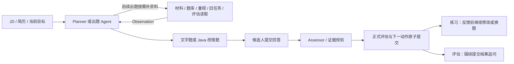

# Java 业务代码改错题规格

> 状态：代码、增量迁移和页面已实施；验收证据及真实模型抽样限制见 [实施 tickets](./41-java-code-repair-tickets.md)。
> 更新：2026-09-12。
> 依据：用户确认只根据 JD 和简历生成业务代码题，只支持 Java；与文字题混合，由 Agent 选择；练习可看反馈继续修改，评估提交后进入追问；代码交给模型审阅，不实际运行。
> 上游：[36 号 Loop 规格](./36-agent-loop-working-memory-spec.md)、[38 号记忆业务复用规格](./38-memory-business-reuse-spec.md)。工具联动以 [39 号规格](./39-interview-agent-tools-spec.md) §4、§6.3 为准，与本文联合设计。

## 1. 目标与范围

模型根据本场 JD、简历和当前考察目标，生成带明确业务场景的 Java 缺陷代码。候选人在编辑器中修改后，Assessor 根据业务要求、提交代码及必要前文判断修复效果，继续使用现有 L0～L4、Evidence 和 gap。

- 代码是为面试构造的示例，页面明确这一点；不得声称来自候选人真实仓库，或据此核验其简历真实性。材料未提供的业务前提必须写成题目假设。
- 题型为 `TEXT | CODE_REPAIR`，属于现有 `ASK` 内容；Agent 根据目标、gap 和本场表现选择，不规定代码题比例、固定顺序或每场最低数量。
- Java 语法基线沿用项目的 Java 21；单个编辑缓冲区包含完成本题所需的代码片段及必要辅助定义。依赖接口的行为在题面写清楚，不要求候选人补齐完整工程。
- 首题和后续题均可采用该题型。历史记忆可帮助选择考察目标；业务背景取自本场材料，当前评分遵守本场证据边界。
- 不拉取或上传仓库，不接入 Pi、代码分析 MCP、分析 worker、编译器、测试执行或沙箱；不增加语言注册表、运行状态或测试通过率。
- 旧仓库分析专项规格已撤回。现存相关代码、API、历史数据的退役须单独追踪消费者与数据；本次删除文档不代表它们已经删除。算法判题按 [11 号规格](./11-algorithm-interview.md) 保持独立语义。

## 2. 用户流程与模式



| 行为 | PRACTICE | EVALUATION |
| --- | --- | --- |
| 首次提交 | 保存代码，形成正式评估 | 保存代码，形成正式评估 |
| 反馈展示 | 展示本次逐项审阅、理由及证据 | 提交后进入追问，保留既有进度信息；详细修复反馈在报告阶段公开 |
| 同题再修改 | Agent 可创建引用原任务的新 `CODE_REPAIR` Turn，用户在上次代码上继续修改 | 已提交代码只读；围绕该提交创建 `TEXT` 追问，不开放同次答案改写 |
| 继续考察 | 可继续修改、文字追问、切换目标或结束 | 可追问、转入另一道题或结束；新代码任务属于新的考察 |

每个被接受的正式答案只属于一个 Turn。练习修订沿用原任务的初始代码、要求和评估参考，每次形成新的 Turn / Assessment；所有正式轮次计入已有整场预算，不新增代码专属次数上限或尝试状态机。

反馈直接投影已提交的 `Assessment.codeReview`、理由和证据，不再调用模型生成另一份反馈。每次修订前已经公开的反馈可由模式和正式记录重建，并作为必要前文进入下一次审阅。不得将看过提示后的修复描述为独立首答；报告仍按 [37 号指南](./37-complexity-reduction-refactoring-plan.md) 取本场最近一次正式评估，等级、理由和证据保持同源。

## 3. 题目与生成契约

### 3.1 扩展现有题目结构

Planner 的首题提案与决策 Agent 的 `QuestionDraft` 使用相同题型契约；不新增 action、Tool 或独立出题服务。新增逻辑结构为 `CodeRepairTask`、`CodeRepairAnswer`、`CodeRepairReview`，分别归属于题目、答案和评估；公开任务使用排除私有参考的 `CodeRepairTaskResponse`。下例省略现有 Target、决策理由和采用来源字段：

```json
{
  "questionType": "CODE_REPAIR",
  "content": "商品库存由多个服务实例共享。并发下单时下面的预留逻辑可能超卖，请保持 reserve 方法入口不变并修复。",
  "codeTaskTurnIndex": null,
  "codeTask": {
    "initialCode": "void reserve(long skuId, int quantity) {\n    int available = stocks.findAvailable(skuId);\n    if (available < quantity) throw new IllegalStateException(\"库存不足\");\n    stocks.setAvailable(skuId, available - quantity);\n}",
    "requirements": ["成功预留的库存总数不能超过可用库存", "库存不足时明确拒绝且不扣减库存"],
    "assumptions": [
      "skuId 一定存在，quantity 已校验为正整数；stocks 是注入的共享数据库访问接口",
      "findAvailable 与 setAvailable 分别执行独立语句，不保证组合操作原子性",
      "可使用 stocks.tryReserve(skuId, quantity)，它原子执行库存充足时的条件扣减，返回受影响行数"
    ],
    "reviewGuide": {
      "checks": [
        {"id": "C1", "defect": "检查和扣减分离会让并发请求超额预留", "trigger": "多个实例同时读取同一库存后分别写回", "acceptance": "成功预留总数受数据库原子条件约束或等价机制保护"},
        {"id": "C2", "defect": "修复并发过程仍需保留库存不足语义", "trigger": "剩余库存小于预留数量", "acceptance": "明确拒绝请求且不改变库存"}
      ]
    }
  }
}
```

| 字段 | 约束与归属 |
| --- | --- |
| `questionType` | 必填枚举；决定本轮输入方式，不从题干或代码内容猜测 |
| `content` | 非空；复用现有字段并保存为 `Turn.question`。原始轮写业务场景和任务，后续轮写本轮修改要求或追问 |
| `codeTask` | 仅生成新代码任务时提供；随原始出题 Turn 冻结，后续通过引用读取 |
| `initialCode` | 非空 Java 代码全文，保留空白与换行；初始代码不随修改覆盖 |
| `requirements` / `assumptions` | 非空字符串数组；要求可判断，依赖、事务、并发、外部调用语义等必要条件必须公开 |
| `reviewGuide.checks` | 非空；每项 `id / defect / trigger / acceptance` 必填，ID 在任务内唯一；评估参考只保存在服务端 |
| `codeTaskTurnIndex` | 新任务提案为 null，服务端提交时设为自身轮次；复用任务时为本场原始任务轮次 |

模型提案的合法组合：

| 场景 | `questionType` | `codeTask` | `codeTaskTurnIndex` |
| --- | --- | --- | --- |
| 普通文字题 | `TEXT` | null | null |
| 新代码题 | `CODE_REPAIR` | 完整任务 | null，由服务端分配 |
| 练习继续修改 | `CODE_REPAIR` | null | 已存在的原始任务轮次 |
| 针对代码的文字追问 | `TEXT` | null | 已存在的原始任务轮次 |

复用引用必须指向当前会话、当前 owner 的原始代码任务，且早于新轮次；不得引用另一条引用形成链。原始任务不得被再次生成或覆盖。文字追问只引用必要代码上下文，仍提交文字回答。

### 3.2 生成质量与上下文

1. 首题 Planner 直接使用已保存的 JD / 简历；后续出题结合常驻事实与 39 号规格的可选工具补充材料，具体分工见 §3.3。当前关联任务、最近代码提交和本轮审阅直接进入上下文；未落库审阅复用请求内结果，不查询临时 ID 或提前写库。
2. 缺陷必须有明确触发条件和业务后果，难度匹配目标；不依赖猜测未给定的接口行为。`reviewGuide` 描述验收语义，不以唯一参考实现限制合法解法。
3. 服务端校验 schema、字段组合、引用归属及现有 Plan / Turn 边界；结构错误沿现有模型提案校验路径显式返回。不能静默改为文字题、过滤坏条目或填充默认代码。
4. 不用“模型生成了参考”证明参考正确。审阅时发现前提不足或参考矛盾，必须给出无法确定的原因，不将题目问题归为候选人错误。
5. 同步调整模型 JSON schema、提示词和输出预算。源码当前 Planner / Interviewer 默认分别为 2048 / 1024 tokens，完整代码加参考需要实测后显式配置；超限或 JSON 截断沿已有错误路径暴露，不增加隐藏裁剪或补偿调用。

### 3.3 与内部工具共同出题

| 信息需要 | 取得方式 | 对代码题的作用 |
| --- | --- | --- |
| 当前目标、开放 gap、固定 Skill、当前任务和最近提交 | ContextAssembler 直接装配；本轮审阅复用请求内结果 | 支持立即修订或追问，无额外读取步骤 |
| 需要核对本场 JD / 简历全文 | `interview_material_read({source})` | 让场景与材料一致，未给定条件明确写为假设 |
| 需要技术考点或量规 | `question_search` / `rubric_search` | 提供素材与评级依据；最终代码和题内评估参考仍由 ASK 提案生成 |
| 需要回看本场较早的任务或某次修订 | `code_task_read({turnIndex})` | 读取原题及指定轮次的代码，按根引用继续同题 |
| 需要该次修复判断和证据 | `assessment_read({turnIndex})` | 取得同轮 `codeReview` 和已验证引用，选择下一步验证内容 |
| 需要避免原题重复或选练习场景 | 现有 `memory_recall` | 沿用模式过滤与 Episode 来源，不把跨场画像送入 Assessor |

后续决策的历史 Turn 保留题型、原任务引用、题面及说明；较早的代码全文通过工具读取，当前关联任务完整装配。前端历史、Assessor 和 Episode 仍按各自职责读取正式原文，不以决策投影替代数据库事实。材料已在本次上下文时直接使用，不同时默认注入全文并重复调用材料工具。

这是一组可选能力，不是“材料 → 搜题 → 量规 → 旧代码”的固定流水线。Agent 可直接生成代码题，或在读过材料后选择文字题；生成质量仍按 §3.2 校验。工具返回空或失败时明确回流，不能偷偷生成默认素材、伪造业务背景或跳过答案评估。

工具的参数、返回字段和错误契约由 39 号规格维护；`code_task_read` 依赖本文 CR-1，不读取旧仓库分析数据。出题素材的采用来源按 39 号规格 §6.2 保存，继续原题则使用 `codeTaskTurnIndex`；两者不能混作候选人能力证据。工具结果只供内部决策使用，候选人仍只收到本文规定的题目和按模式公开的反馈。

## 4. 提交与候选人响应

扩展现有 `SubmitAdaptiveAnswerRequest` 和 `CandidateAnswer`，新增 `codeRepair`；继续使用当前会话的 answers 同步 / SSE 入口：

```json
{
  "turnIndex": 4,
  "answer": "使用数据库条件扣减，并在未扣减时报告库存不足。",
  "codeRepair": {
    "code": "void reserve(long skuId, int quantity) {\n    if (stocks.tryReserve(skuId, quantity) == 0) {\n        throw new IllegalStateException(\"库存不足\");\n    }\n}"
  }
}
```

- `TEXT` 要求非空 `answer`，不接受 `codeRepair`；`CODE_REPAIR` 要求非空 `codeRepair.code`，`answer` 为可选修改说明，允许不填。空白说明统一为 null，非空原文及代码不做 trim、格式化或换行重写。
- 客户端不提交题目原文、评估参考、语言或任务归属；服务端从当前 Turn 确定。`codeRepair` 与旧 `codeSubmission(problemId/scenarioId/language/runMode)` 互斥；新题型不进入旧沙箱提交分支。
- 同轮相同代码和说明重试复用已接受答案；不同 payload 显式冲突。正式提交后再次编辑必须由新 Turn 承载，不能 UPDATE 原答案。
- 现有“是否已有答案”的判断须覆盖 `answer` 或 `submitted_code`，同步修改领取、状态推导、上下文重建和恢复；不能填充虚假说明绕过 `answer != null`。
- SSE 沿用阶段事件和最终权威响应。代码改错支持该入口；旧执行提交的同步限制按原语义保留。失败保留草稿和已接受答案，可按现有恢复流程重试。

每个候选人 Turn 响应补 `questionType`、`codeTaskTurnIndex`、公开 `codeTask`、`submittedCode` 和按模式投影的 `codeReview`；当前题从同一 Turn 投影，避免另存一份题目。公开任务只含 `initialCode / requirements / assumptions`，引用轮由服务端解析原任务。

`reviewGuide` 不得进入创建、查询、历史、记忆页面、SSE 或错误响应。不能直接序列化实体或模型原始 JSON；评估模式进行中的所有候选人入口均遵守反馈时机，不能仅在前端隐藏字段。出题提示词同时禁止在可见题干、追问和决策理由中复述修复答案。

## 5. 评估与证据契约

### 5.1 复用 Assessment

`AssessmentContext` 增加任务公开内容、服务端评估参考、提交代码及同题必要前文；原有维度、量规和开放 gap 保留。`AssessmentProposal` 保留 `depthLevel / confidence / rationaleSummary / probeGaps / resolvedGaps`，增加 `codeReview`：

```json
{
  "codeReview": {
    "checks": [
      {"checkId": "C1", "result": "SATISFIED", "reason": "条件扣减在数据库内原子完成，多个实例共享同一库存约束。"},
      {"checkId": "C2", "result": "SATISFIED", "reason": "未扣减时抛出库存不足异常。"}
    ]
  }
}
```

| `result` | 语义 |
| --- | --- |
| `SATISFIED` | 提交代码在已给定条件下满足该项业务要求 |
| `NOT_SATISFIED` | 有可指出的反例或未修复问题，说明触发条件 |
| `UNDETERMINED` | 条件不足或参考存在矛盾，说明缺失信息，不强行判错 |

代码改错评估要求每个参考 `checkId` 恰好出现一次，不接受未知或重复 ID；文字追问继续使用普通评估，不因有关联代码就生成另一份修复评分。新引入问题和未解决问题继续进入现有 gap；`checks` 不成为第二套 gap 状态或等级。

评估同时阅读代码和说明，允许不同实现满足相同业务要求；不能因为说明声称“已修复”就忽略实际代码。由模型静态审阅得出的结论不得描述为“编译通过”“测试通过”或真实执行结果，不生成 `SandboxExecution`、运行 Evidence、独立分数或 `passed`。

### 5.2 SourceQuote 与位置校验

将当前仅含字符串的引用扩展为有来源的 `SourceQuote`，同时用于 `evidenceQuotes[]`、`ProbeGap.anchor`、`GapResolution.evidenceQuote`：

```json
{"source":"SUBMITTED_CODE","quote":"stocks.tryReserve(skuId, quantity)"}
```

- `source` 仅为 `ANSWER_TEXT | SUBMITTED_CODE`；`quote` 非空。文字说明与提交代码都只从当前正式答案取原文，不从初始缺陷代码、模型参考或跨场历史取候选人证据。
- 服务端精确匹配指定原文。重复片段时，模型需补 `startOffset` 消歧；按保存字符串的 UTF-16 单元、从 0 开始计数，验证该位置切片等于 `quote`。歧义或不存在的引用沿现有评估校验错误路径暴露。
- 经校验持久化 locator `{source, startOffset, endOffset}`，范围为左闭右开，行号由原文计算；不在 locator 再存一份 quote。代码引用不得沿用折叠空白后查找的文字归一化逻辑。
- Evidence 来源轮由所属 Assessment 确定；gap 锚点由创建 Assessment 确定，关闭依据由 `closed_by_assessment_id` 确定。不能在原 gap 的答案中查找后续轮的关闭引用。
- 原始代码只是题目材料。候选人提交代码的引用沿用 `QUOTE` 语义并标记来源，不复用旧仓库 `CODE_FACT` 或伪造工具结果。缺失实现可引用相关上下文并在理由中说明缺失，不能编造不存在的代码行。

## 6. 持久化、事务与记忆

第一版不新建业务表；在四张现有表上增加八个字段：

| 表 | 字段 | 保存语义 |
| --- | --- | --- |
| `agent_turns` | `question_type` | 非空 `TEXT / CODE_REPAIR`，定义本轮输入方式 |
| `agent_turns` | `code_task_json` | JSONB，完整任务含私有参考，仅原始任务轮保存 |
| `agent_turns` | `code_task_turn_index` | 本场原始任务轮次；原始轮指向自身，复用轮直接指向原始轮 |
| `agent_turns` | `submitted_code` | TEXT，该轮正式代码原文；修改说明复用 `answer` |
| `agent_assessments` | `code_review_json` | JSONB，该次正式逐项审阅 |
| `agent_evidences` | `quote_locator_json` | JSONB，来源和位置；原句复用 `quote_text` |
| `agent_assessment_probe_gaps` | `anchor_locator_json` | JSONB，创建 gap 的锚点来源和位置；原句复用 `anchor` |
| `agent_assessment_probe_gaps` | `closure_evidence_locator_json` | JSONB，关闭依据的来源和位置；原句复用 `closure_evidence_quote` |

约束与迁移：

1. 保留 `(session_id, turn_index)` 唯一约束，以 `(session_id, code_task_turn_index)` 复合外键限制同场引用；原始根、自引用、题型和正文的字段组合在写入边界校验，提交事务仍检查归属与执行令牌。
2. `CODE_REPAIR` 必须关联任务，只有原始轮可存任务 JSON；复用轮不得复制任务。`TEXT` 的 `submitted_code` 必须为空，代码改错正式提交则不能为空；待答题允许尚无答案。
3. 使用新增 Flyway 迁移，不改历史脚本。先核对旧文字题、旧沙箱提交和历史证据；旧题按既有输入协议迁移为 `TEXT`，旧沙箱字段保留原意，不把历史 `answer` 擅自转换为改错代码。
4. 历史 locator 可以为空，明确代表未记录位置，继续按既有来源读取；新的文字与代码引用按新契约写入。不能给历史数据编造代码来源、参考、评审或偏移量。

继续使用现有短事务领取答案、事务外 Assessor / Loop、短事务提交 Assessment / Evidence / gap / Episode / 后继 Turn 的路径。重复请求只推进一次；模型失败、响应丢失或进程重启不抹掉已接受代码；旧执行者不能覆盖新领取结果。

WorkingMemory 只记录本场 gap 和已有事实引用，不复制任务、代码或反馈。Episode 仍关联 Turn 与 Assessment，读取投影补齐任务、提交代码及当时已公开反馈；Semantic 继续按既有 Skill 查询。无需新增代码记忆表、指纹、独立修订计数、后台整理或补偿任务。

公平性按场景装配：本场 Assessor 可读同题之前的原始提交和候选人已获得的反馈，不混入未公开的历史评级；跨场 Episode 供出题使用，不进入当前评分。提示后的改进保留可追溯上下文，不另建能力分数或首答优先规则。

## 7. 前端交互

在现有 [InterviewSessionPage][session-page] 按题型渲染，延续工作区纸灰、墨色和现有字体。代码编辑区使用项目已有 IBM Plex Mono；编辑器采用已锁定版本的 CodeMirror 6 和 merge 扩展，支持 Java 高亮与 diff。

- 桌面左侧显示业务场景、要求与假设，右侧为可编辑代码；窄屏按题面、代码、提交顺序纵向排列，代码区独立横向滚动。
- 初始加载原始代码；练习修订加载同任务最近一次正式提交。提供“原始代码 / 当前修改 / 差异”切换，差异以原始题目为基线，保留修改说明输入框。
- 主操作为“提交修改”，展示现有评估 / 生成阶段和明确错误。页面标明“模型代码审阅”，不提供运行、编译或测试按钮。
- 切换视图和请求失败不丢草稿；在现有页面状态上补齐 `sessionStorage` 草稿保存，包含代码和说明，以用户、会话和轮次隔离。刷新先取服务端已接受答案；尚未提交时恢复本轮草稿，无草稿才使用初始值。服务端确认接受后清理对应草稿，草稿存取失败明确提示。
- 正式历史提交只读并带对应反馈；练习的新轮次允许继续编辑，评估追问显示提交代码和文字输入框。不可通过切换编辑器覆盖上一轮答案。
- 创建、恢复、会话历史、Episode 页面和报告保持同样的题型展示与字段权限；反馈引用可定位到对应说明或代码，不把初始错误代码高亮成候选人错误。

## 8. 实施切片与交付范围

以下切片已实施，逐项验收记录见 [41 号 tickets](./41-java-code-repair-tickets.md)。小 DTO / record / enum 优先由其唯一 owner 内嵌；复用现有装配与查询接口，不增加纯转发层或通用任务框架。

| 切片 | 实现入口 | 出口 |
| --- | --- | --- |
| CR-1 题型与事实 | [首题提案][initial-question]、[Turn 与状态][turn-entity]、[请求][answer-request]、[候选人响应][interview-response]；新增改错任务和独立代码答案 | 增量迁移、题目联合契约、答案领取 / 恢复及公开 DTO 完整 |
| CR-2 模型、工具与评估 | Planner、[决策上下文][agent-context]、39 号工具契约、[评估提案][assessment-proposal]及[证据校验][evidence-validator]；接通按需材料、代码工具及来源定位 | 首题及后续题均可生成；材料 / 素材 / 旧代码 / 评估按需读取，代码评审与 gap 证据可追溯 |
| CR-3 页面与读取 | [会话页][session-page]、[Episode 查询][episode-query]及报告；补齐代码投影、编辑器和草稿持久化 | 编辑 / diff / 草稿恢复、练习修订、评估追问和历史展示贯通 |
| CR-4 验收 | 下表中的契约、并发、权限与模型场景；真实模型抽样独立于确定性测试 | 没有执行副作用、参考泄漏、答案覆盖或历史画像污染评分 |

各切片内将结构整理、行为变更和数据库迁移分开提交。CR-1 完成后接入 `code_task_read` 及 `assessment_read.codeReview`；材料和题库工具可按 39 号规格独立实现，CR-2 联调时必须贯通实际采用来源的保存与恢复。本能力不以 MCP、分析 worker 或算法沙箱上线为前置。

## 9. 验收标准

| 场景 | 预期结果 |
| --- | --- |
| 首题 / 后续出题选择代码题 | 业务背景来自本场材料或明示假设，原始代码、要求和参考可恢复 |
| Agent 混合选择题型 | 文字与代码可以连续或交替出现；没有写死比例和切换规则 |
| 出题按需调用材料、素材和量规工具 | 读取内容影响出题；信息足够时可直接 ASK，没有每轮必调工具 |
| 回看指定代码轮及其正式评估 | 原任务、所选提交和评审同源；不代取最新代码，不重复评分 |
| 当前代码与审阅已经在上下文 | 可直接决定练习修订或评估追问，不先调用工具查询未落库记录 |
| 只有代码、没有修改说明 | 能正式提交并恢复，状态、幂等比较与评估不依赖伪造文字 |
| 错误字段组合 / 跨场任务引用 | 在相应边界明确拒绝，不转换题型、不忽略代码 |
| 同轮重复 / 并发提交 | 相同 payload 只产生一次评估及推进，不同 payload 冲突 |
| 接受答案后模型失败或重启 | 已接受代码完整保留，按既有令牌与租约恢复，不重复推进 |
| PRACTICE 看反馈后再改 | 新轮引用原任务，旧提交只读；下一次评分知道已经提供哪些反馈 |
| EVALUATION 提交后追问 | 答案冻结，追问基于实际提交；进行中的公开接口无详细修复提示 |
| 等价修复 / 部分修复 / 引入新问题 | 按业务语义分别判断，理由和现有 gap 一致，不机械匹配标准答案 |
| 题目条件不足或参考错误 | 明确 `UNDETERMINED` 及原因，不编造执行结果或候选人缺陷 |
| 引用代码、重复片段、gap 关闭 | 来源及范围命中相应轮的真实提交；重复引用消歧，错误明确暴露 |
| 刷新、失败、历史和报告读取 | 草稿及正式代码各按归属恢复；原题不被覆盖，等级 / 理由 / 证据同源 |
| 提示注入 / 隐私字段检查 | JD、简历、说明和代码注释均为数据；公开 DTO / SSE / 日志不泄漏评估参考 |
| 代码题全流程 | 无沙箱任务、代码执行或分析任务；不恢复旧仓库分析工具和后台链路 |

实施验证包括迁移与 PostgreSQL 约束、回答并发 / 恢复、API 字段投影、前端编辑流程及真实模型样例审阅。后端测试遵守 60 秒硬超时；只有文档修改时运行文档链接、示例结构和差异检查，不以此宣称功能验证通过。

[initial-question]: ../../app/src/main/java/interview/guide/modules/interview/agent/adaptive/planning/InitialQuestionProposal.java
[turn-entity]: ../../app/src/main/java/interview/guide/modules/interview/agent/adaptive/persistence/session/AdaptiveAgentTurnEntity.java
[answer-request]: ../../app/src/main/java/interview/guide/modules/interview/agent/adaptive/api/SubmitAdaptiveAnswerRequest.java
[interview-response]: ../../app/src/main/java/interview/guide/modules/interview/agent/adaptive/api/AdaptiveInterviewResponse.java
[agent-context]: ../../app/src/main/java/interview/guide/modules/interview/agent/adaptive/core/context/AgentContext.java
[assessment-proposal]: ../../app/src/main/java/interview/guide/modules/interview/agent/adaptive/assessment/depth/AssessmentProposal.java
[evidence-validator]: ../../app/src/main/java/interview/guide/modules/interview/agent/adaptive/assessment/evidence/AssessmentEvidenceValidator.java
[session-page]: ../../frontend/src/pages/workspace/InterviewSessionPage.tsx
[episode-query]: ../../app/src/main/java/interview/guide/modules/interview/agent/adaptive/memory/episode/EpisodeQueryService.java
