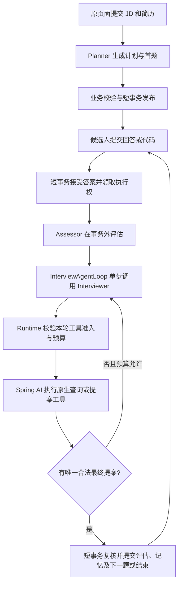

# Spring AI 原生工具与自有 Agent Runtime 改进规格

日期：2026-09-21。状态：NATIVE-1～4 实现已完成并推送；NATIVE-5 离线回归与本地 HTTP 集成已通过，真实模型及原页面验收已执行但存在阻塞。详见 [实施票据](./45-native-tools-agent-runtime-tickets.md)。

## 1. 依据与裁决

依据本轮用户确认：删除自定义工具名称分发、JSON 参数绑定、tool call/result 消息转换、`CallReadTools` 和重复 Gateway 基础设施；工具改用 Spring AI 原生协议，Agent Runtime 仍由项目控制。保留 Planner、Assessor、Interviewer 的具体职责，将下一题和结束建议改为原生提案工具。

上游：[Agent 运行方式](../design/03-agent-loop-and-working-memory.md)、[36 号规格](./36-agent-loop-working-memory-spec.md)、[38 号记忆规格](./38-memory-business-reuse-spec.md)、[39 号工具规格](./39-interview-agent-tools-spec.md)、[40 号代码题规格](./40-java-code-repair-spec.md)、[42 号上下文与 RAG 规格](./42-interview-context-reference-rag-spec.md)。

本规格更新这些文档中的工具传输与执行方式，以及模型侧 ASK/FINISH 动作 JSON 表达；不取消出题和结束的业务语义，不改变模型与 Java 的策略控制边界。旧文档要求使用 `ReadOnlyAgentTool`、`ToolGateway` 或 `CallReadTools` 的部分，在本次迁移范围内以本文为准。未涉及的安全、正式事实、记忆和沙箱约束继续适用。

当前 `AGENTS.md` 仍以现有 ToolGateway 描述工具安全路径；本轮明确授权的是替换基础设施，原有安全职责必须完整迁移，不把该描述解释为永久保留旧类。本文不修改共享规则文件或用户维护的自然语言设计。

## 2. 目标与非目标

目标：

- 模型只使用一套原生工具协议进行查询和提交最终面试提案。
- 框架负责工具定义、参数绑定、名称分派和标准调用结果消息；项目负责业务控制。
- 保留一个 `InterviewAgentLoop`，能在每次模型响应与工具执行之间检查资源和业务边界。
- 新增普通查询工具时，不再同时修改动作联合类型、手写参数提示词和分派器。
- 保持候选人 HTTP/SSE、MCP 公开业务接口、历史读取和正式数据语义。

非目标：

- 不建设通用 Tool 平台、Agent 角色平台、工具市场或第二个执行循环。
- 不启用框架自动循环后再在外层叠加同职责的自有工具循环。
- 不新增 Intent、工具执行表、恢复调度、持久化消息日志或后台记忆任务。
- 不将 Planner、Assessor 的正常结构化结果一律改造成工具；它们不是工具调用协议。
- 不把 Java 改错题改成沙箱执行，不改仍在使用的算法执行 Application Command。
- 不因迁移提高预算、放宽权限或新增静默降级。

## 3. 迁移前实现与问题（历史）

| 位置 | 当前职责 | 本次处理 |
| --- | --- | --- |
| `SpringAiInterviewDecisionModel` | plain client 获取 `InterviewDecisionOutput` JSON | 接收原生模型响应，不再把每次输出都解析为动作 JSON |
| `InterviewAgentLoop` | 处理 Ask/CallReadTools/Finish 与 Observation | 保留业务循环，消费原生 tool calls 和请求内最终提案 |
| `ContextAssembler` | 固定工具名白名单 | 保留授权范围含义；改为从本轮实际注册的工具定义生成可见范围 |
| 系统提示词 | 重复书写工具名、参数格式和动作协议 | 只保留使用策略与业务规则；参数契约来自工具定义 |
| `ToolGateway` | 分派、调用、结果包装及业务检查 | 删除重复执行机制，迁移必要检查后删除旧实现 |
| 各 `ReadOnlyAgentTool` | Map 参数校验和业务查询 | 类型化原生工具方法，保留业务校验与数据投影 |
| `AdaptiveAnswerProgressionService` | 领取答案、事务外推理、最终提交与失败记账 | 保持执行令牌、租约和短事务路径 |

迁移前没有将这些工具注册给 Interviewer 的原生工具调用请求。现已通过显式 callbacks 接入；只在方法上增加 `@Tool` 并不足以完成迁移。

## 4. 多 Agent 与工序边界

| 角色 | 输入与输出 | 迁移后的职责 |
| --- | --- | --- |
| Planner | 本次 JD、简历、级别、分类目录及允许的练习历史 → 计划和首题 | 保留一次结构化规划；不新增查询循环 |
| Assessor | 本场题目、答案/代码、量规、必要前文 → 评级、证据、gap、逐项代码审阅 | 保留独立评估和来源校验，不开放新的历史读取能力 |
| Interviewer | 本场覆盖、评估结果、WorkingMemory、按需查询结果 → 下一题或结束建议 | 查询和最终提案全部通过原生工具 |
| Runtime | 组织调用、控制预算、验证提案、提交正式结果 | 不替模型选择 Target、Gap、工具顺序或正常结束策略 |

图中最后一步只有下一题时继续答题，结束时进入报告。最大轮次等既有硬边界仍由 Runtime 执行；到达最后一轮仍需保存本轮评估。

Planner 的首题不强行多绕一次工具调用；移除其通往旧动作传输对象的依赖，直接生成相同业务提交提案。候选人原流程代码首题要求继续适用。租户入口保持既有契约，不借本次迁移统一扩大要求。

## 5. Spring AI 集成边界

依赖基线为仓库锁定的 Spring AI 2.0.0，不以升级依赖作为默认实施步骤。

- 查询与提案使用 `@Tool`/`@ToolParam` 和类型化参数；需程序化控制时使用框架 `ToolCallback`，不另建同功能接口。
- 由当前请求提供实际允许的 callbacks，不把全部 Spring Bean 工具自动暴露给所有角色。
- 使用 `ToolCallingManager.executeToolCalls(...)` 完成原生工具执行和结果消息生成。
- Runtime 保留单步模型调用：可以使用现有 Provider 提供的 `ChatModel`，或明确关闭自动工具循环的 `ChatClient`。具体 API 以 2.0.0 实际依赖验证为准，优先保留现有 Provider、观测与模型参数路径。
- `getPlainChatClient` 是项目名称，不能据此认定自动循环已经关闭；以一次模型响应即返回的契约测试证明。
- 不调用会自行跑完多个工具往返的执行链后，再声称 Runtime 能检查其中每一步。
- 原生模型响应先判断 tool calls，再交给框架执行；Interviewer 不继续套用“必须返回 AgentDecision JSON”的 `invokeOnce` 路径。
- Planner/Assessor 继续使用原有结构化解析、超时及错误路径。Interviewer 的单步调用复用共享 Provider 和观测，不新造 HTTP 客户端或重试系统。

模型与 Provider 必须实际支持原生 tool calling。配置兼容性通过合约及真实模型测试确认；不支持时显式失败，不回退到旧动作 JSON，不宣称只改注解即可兼容所有 Provider。

## 6. 工具集合与契约归属

原有七个查询工具迁移：`rubric_search`、`memory_recall`、`interview_material_read`、`question_search`、`code_task_read`、`assessment_read`、`reference_search`。

每个工具在定义处集中说明名称、用途和适用场景；类型化参数及注解生成输入契约，结果 DTO 说明字段业务含义。模型可见定义中的结果用途可写入 description，不假设框架会自动发送输出 Schema。系统提示词不再复制一份参数清单。

- 删除工具中仅为 Map 取值、数字转换和名称路由存在的代码。
- 保留正整数范围、当前 Plan 成员关系、归属、模式可见性、来源有效性等业务校验。
- Schema 不是运行时授权。必须测试未知字段、缺失/null、错误类型、数字小数或溢出、枚举非法值；框架默认宽松转换不得弱化当前边界。
- 优先配置框架转换器/校验扩展点；必要的薄适配只补足已证明缺失的约束，不逐工具重新实现 JSON 解析器。
- 工具名来源于实际定义；按角色/场景选择工具仍属业务配置，可以引用工具 Bean 或 callback，不再维护不相干的手写名称清单。
- 未授权或未知工具请求必须在执行前拒绝，不能仅依赖“没有把名字告诉模型”。不得使用全局 resolver 意外找到本场未注册的工具。

### 可信上下文

通过服务端 `ToolContext` 传递 owner、session、mode、本轮上下文、绝对 deadline 和请求内来源集合。模型参数不得覆盖这些字段。共享 Spring Bean 不得保存某次请求的候选人、提案或来源集合；请求数据不得使用可能跨异步线程失效的隐式 ThreadLocal。

保留 `SessionReadBoundary` 的归属读取语义；其通用 Map 解析部分迁移到类型绑定。固定流程必需的事实读取继续直接调用服务，不为统一形式包装为工具。

## 7. 原生最终提案工具

Interviewer 通过两个原生工具交付最终建议。它们是请求内提案，均不写数据库、不发布 SSE 正式题目、不结束正式会话。

| 工具 | 参数的业务含义 | 结果 |
| --- | --- | --- |
| `propose_question` | targetId、可选 sourceGapId、题面、选择理由、采用来源、TEXT/CODE_REPAIR 及任务/根引用、完整 WorkingMemory 快照 | 提案有效或明确拒绝原因；有效提案交由 Runtime 接受 |
| `propose_finish` | 结束理由、完整 WorkingMemory 快照 | 结束建议有效或明确拒绝原因；不直接修改 Session |

字段约束继承现有 `QuestionDraft`、代码任务、Gap 和 WorkingMemory 校验。不新增链式思维输出、评分字段或私有参考公开字段。提案参数中的任务原文、reviewGuide 只用于服务器内部链路。

删除模型侧 ASK/FINISH 枚举和动作 JSON Schema。业务提交端仍可以用内嵌 record/sealed type 区分“发布问题”与“结束”；不要为删除两个名称而改写历史状态值或隐藏业务分支。临时旧类型适配仅允许在迁移提交中存在，最终不保留双协议解析。

### 接受与冲突规则

- 一次模型响应中的全部工具调用仍由 Spring AI 处理标准参数与消息；Runtime 负责检查批次是否具有唯一明确的最终提案，不按调用顺序取最后一个覆盖前一个。
- 同一响应出现多个最终提案（包括问题与结束混合），全部不予接受，明确反馈模型重新提出一个最终决定；不能写入任何正式事实。
- 查询与提案出现在同一响应时，可以执行允许的只读查询，但该提案不能采用模型尚未看见的同批查询来源。采用来源只能来自本次模型调用之前已提供且验证有效的上下文。
- 一个合法提案在整批处理完成后由 Runtime 接受，随后停止本轮推理；工具方法本身不能提前提交。不能利用 `returnDirect` 绕过全批检查和最终业务校验。
- 非法提案返回可理解的拒绝信息，预算允许时由同一个 Loop 继续。模型返回普通文字而没有最终提案时，不将文字猜测为问题或结束；反馈缺失提案，预算耗尽则明确失败。
- 提案工具调用不计为只读查询次数；仍计入既有决策步骤和共享 deadline。不得因 ASK 改成工具而无意减少原有可用查询预算。

以上规则落实原有“一轮只提交一个决定”和来源真实性，不新增面试题数或追问策略限制。

## 8. Runtime 的控制职责

一次循环负责：

1. 从正式事实和已采用快照建立本轮上下文，注册允许的原生工具。
2. 在同一绝对 deadline 与既有 token/步骤预算内调用模型一次。
3. 检查响应中的调用范围、数量与重复请求，交给框架执行；每个工具入口仍检查 deadline，避免批次后面的调用在超时后开始。
4. 对非法参数或提案返回明确反馈；对合法查询接收框架消息与可信来源。
5. 没有最终提案则按预算继续；存在唯一合法提案则交给既有提交路径。

不预选 Target/Gap，不固定查询顺序，不把已触达预算解释为候选人能力不足。禁止把内部错误记成负面证据。

框架绑定前后校验、批次执行超时、取消后迟到结果、异常传播行为均需实测。仅在调用前看一次时间不满足 deadline 要求；迟到执行不得写入已结束请求的提案或来源集合，也不得进入正式提交。

按后续用户明确要求，参数已确定且不依赖彼此结果的只读调用采用限并发执行；默认 `maxConcurrentReadTools=3`，共享本轮绝对 deadline。依赖前一查询结果的参数必须等下一次模型决策，不能在同批猜测。

Spring AI 2.0.0 的 DefaultToolCallingManager 无 executor 配置，官方当前实现也仍顺序调用（[源码](https://github.com/spring-projects/spring-ai/blob/main/spring-ai-model/src/main/java/org/springframework/ai/model/tool/DefaultToolCallingManager.java)）。因此本模块 InterviewToolBatch 只补批次并发及汇合，每个实际调用继续委托原生 manager，保留其名称解析、参数绑定和调用 ID。打开模型 `parallelToolCalls` 是允许模型提交多调用，不是后端并发的唯一保障。

单个调用的运行时失败/本地超时分别返回 TOOL_ERROR / TOOL_TIMEOUT，不丢弃其他成功结果；最终按原调用顺序及原 ID 汇合。共享 deadline 耗尽时保留已完成的批次结果并取消未完成任务，但不能再发起模型调用或接受/提交提案；迟到结果不得追加来源。读取预算与去重仍由同步作用域裁决，同批并发调用不承诺开始/完成顺序。

出题/结束提案在查询汇合后串行校验；校验使用批次开始前冻结的可见证据，多提案仍全部拒绝。该协调器没有工具注册、参数解析、持久化或第二套模型 Loop，不恢复旧 ToolGateway。

## 9. 消息、错误、WorkingMemory 与来源

### 消息与输入预算

Spring AI 持有标准 assistant tool-call / tool-result 消息结构与调用 ID 对应关系。Runtime 消费框架生成的完整消息历史，不再经 `ReadToolCall → DecisionObservation` 做一遍工具协议转换。

原有业务拒绝内容可以继续使用小 DTO，但不再作为另一套模型工具调用封装。预算或纯文本提案拒绝使用普通业务反馈消息；有实际 tool call 的拒绝走框架工具错误/结果路径，不能伪造不存在的调用 ID。

保留 42 号规格的完整片段裁剪、去重和输入总预算。计算须包含原生工具 Schema、工具调用参数、工具结果及历史消息，不能同时注入原生结果和旧 Observation 造成重复。截减消息时不能留下孤立的调用或结果；优先在结果进入消息前限制可选片段，必需事实超限明确失败。

### 错误语义

保留无命中、非法输入、工具故障、超时的区别。参数/提案校验错误在预算内回流模型；业务异常及内部故障沿既有语义明确暴露，不统一转成空集合或成功字符串。错误处理配置不得把归属失败降级成普通查询无命中。日志脱敏，不输出密钥、完整简历或私有 reviewGuide。

### WorkingMemory 与证据

工具消息是本请求临时推理上下文，不是正式事实，也不是新的持久化记忆。查询返回的可信来源登记在请求范围内，框架 call ID 不等于 Evidence ID。

最终提案携带完整 WorkingMemory，复用引用及形状校验；接受后随正式结果保存。中间推理由原生消息承载，不增加独立 memory 更新工具或每步快照写库。

Episode/Question/Rubric 的真实采用来源仍需严格校验并沿现有链路持久化；Rubric 仍保留量规快照。仅检索过不代表已采用。专业参考的 reference_search 来源仍不能变成候选人评分证据。评估模式不得通过 memory_recall 等工具读取禁止使用的历史能力。

## 10. 持久化、恢复与对外兼容

- 答案短事务领取 → 事务外评估及工具循环 → 短事务复核 owner、状态、原答案、执行令牌 → 保存评估、采用快照和下一题/结束。
- 提案工具成功只表示请求内校验通过，不表示数据库提交成功；提交失败必须走原失败记账。
- 相同答案重试不重复推进，不同 payload 冲突，旧执行者不能提交。失败不得删除已接受答案。
- 跨请求仅恢复正式事实和已采用快照；未提交工具调用和提案可重算，不恢复旧请求消息循环。
- 不删除或改写历史 Turn、代码任务、评估、证据和状态字段。预计无需迁移；若实施发现必须改表，单独说明数据语义和迁移依据。
- HTTP/SSE/MCP 的候选人响应保持现有投影；原生工具消息不直接透传前端，private reviewGuide 不泄漏。
- 算法沙箱仍走独立应用服务和幂等执行事实，不接入只读查询或提案工具。

## 11. 删除与保留清单

| 对象 | 最终要求 |
| --- | --- |
| `AgentDecision.CallReadTools`、`ReadToolCall/Batch/Executor` | 删除模型协议及执行消费者，迁移对应行为测试 |
| `ToolGateway` 名称 Map、执行分派、消息包装 | 删除；权限、deadline、来源检查迁入实际业务边界 |
| `ReadOnlyAgentTool`、`ReadToolRequest` 的旧统一入口 | 原生工具完成接入后删除，不保留一层同形转发接口 |
| 工具 Map 参数解析、手写参数提示词 | 删除重复实现，严格绑定和业务校验分别验证 |
| `InterviewDecisionOutput` 的动作联合 Schema | 删除；原生提案工具取代 Interviewer 最终动作 JSON |
| `DecisionObservation` / `ReadToolResult` | 按用途消融；保留必要错误/来源数据，不保留重复工具传输封装 |
| `AgentDecisionValidator` 等业务校验 | 保留行为，按实际输入改签名；不因旧类型被删而删除校验 |
| Provider、结构化 Planner/Assessor、事务服务、公开 DTO | 复用；仅调整必要接线，不为本次迁移重建 |

不得新增与旧 Gateway 同职责、只换名称的 NativeToolGateway；需要共享安全适配时，以具体缺口说明必要性和 owner，优先内嵌或复用现有服务。

## 12. 实施顺序与验收

| 步骤 | 范围 | 验收出口 |
| --- | --- | --- |
| NATIVE-1 | 核对 2.0.0 API，验证单步调用、绑定、错误、消息历史与批次行为 | 使用可控 Provider 响应的合约测试；确认没有隐藏自动循环 |
| NATIVE-2 | 将七个查询工具迁为原生定义，接通可信上下文与安全检查 | 真实工具方法的参数/归属/模式/来源测试，不只 mock callback |
| NATIVE-3 | 同一个 Loop 改为原生响应；接入两个提案工具 | 查询往返、非法反馈、唯一提案、预算和 WorkingMemory 均贯通 |
| NATIVE-4 | 对接原有创建/答题/提交/恢复；删除旧协议 | HTTP/MCP 兼容、代码题模式及事务幂等回归；无双协议运行 |
| NATIVE-5 | 完整回归与真实 Provider、原页面验收 | 记录成功与失败样例、延迟、token、调用次数及未验证项 |

每步可独立审阅，但最终切换前必须完成全部必要接线。实现与旧协议删除可按结构/行为拆提交，不新增长期兼容开关或静默回退。

必须覆盖的失败与一致性场景：

- 未注册工具、跨用户/租户/会话请求、范围外 Target、反馈提前公开被拒绝。
- 未知参数、非法数字与额外 JSON 等无法绕过旧校验；可纠正错误能回流模型后成功。
- 一次原生响应多个查询、重复查询、冲突提案、提案与查询混合、无提案纯文本。
- 最后一个查询耗尽预算后仍可合法提交提案；决策步骤、共享 deadline 不被重置。
- 工具与模型超时、批次中途失败、取消后迟到结果不能污染当前提交。
- 真实采用来源、伪造引用、跨请求旧来源、同批尚未看到的来源、reference_search 不成为评分证据。
- 评估历史隔离、练习反馈读取、代码任务根引用、UTF-16 证据、reviewGuide 私密性保持。
- 并发相同答案、不同答案冲突、租约失效与旧执行者隔离、正式提交失败及恢复。
- tool-call/result 一一对应，裁剪后协议仍合法；不双份注入结果，不持久化整个推理消息历史。
- Planner 与 Assessor 输入职责不漂移，原始 JD/简历到代码首题仍贯通，历史 HTTP/MCP 会话可继续读取和答题。

按影响运行后端编译及相关测试，有限超时按实际规模设置。前端变更需构建及实际页面验证；即使公开协议不变，最终真实验收仍从原页面完整走一次查询、提交、反馈、刷新和重试。离线模拟通过不代表真实 Provider 支持或模型质量通过。

## 13. 已知问题与实施前核对项

- 当前“规划结果包含未知考察重点标识”属于 Planner 输出与目录校验，工具原生化不会自动修复。不得把它记为本规格已解决；错误标识诊断及创建纠错路径另行处理。
- 本次结构迁移不证明此前 CR-08 代码题质量和 RAG 真实验收已通过。
- 文档参考的官方当前版本为 2.0.1，项目依赖为 2.0.0。错误处理扩展点、严格参数绑定、自动 Advisor 行为与消息预算接入点须在 NATIVE-1 实测。发现缺失能力时先说明差异，不自动升级或削弱规则。
- 正常结束建议仍由 Interviewer 提出；不以本次删除 ASK/FINISH 名称为由改成固定轮数策略。

## 14. 框架资料

- [Spring AI Tool Calling](https://docs.spring.io/spring-ai/reference/api/tools.html)：原生工具定义、参数及服务端上下文。
- [ChatModel Tool Calling](https://docs.spring.io/spring-ai/reference/api/tools/chatmodel-tool-calling.html)：应用持有循环、ToolCallingManager 执行和框架消息历史。
- [ToolCallingAdvisor](https://docs.spring.io/spring-ai/reference/api/tools/tool-calling-advisor.html)：框架自动循环；本方案不与自有 Runtime 重叠启用。

## 15. 实施结果与验收边界（2026-09-21）

- 七个原生查询及 `propose_question` / `propose_finish` 已贯通。Spring AI 执行绑定、名称解析与 call/result 配对，自有 Loop 控制每次模型调用、deadline、读取预算和最终提案。
- 旧 Gateway、ReadToolCall/Batch/Executor、ReadOnlyAgentTool、ReadToolRequest、CallReadTools 和 InterviewDecisionOutput 已删除，无旧协议回退。保留的 AgentDecision 是正式业务提交提案，不再作为模型动作 JSON。
- schema 校验适配补足 Spring AI 2.0.0 默认宽松绑定；请求级上下文登记真实来源并拒绝迟到结果。具体 QueryTools 集合防止内部 callbacks 被 MCP 自动发布。
- 用户/系统提示词统一原生协议，保留并计入防注入指令；旧未消费的 interviewer 提示词及配置删除。Provider 及遥测路径复用。
- 所有票据均经过独立 subagent 审查（NATIVE-1 补审），审查发现及测试结果见票据。没有数据库迁移、公开 API 变更或部署。
- 真实环境已恢复并通过原页面验收首题 CODE_REPAIR；练习创建的重复/范围外主题及代码评估引用校验错误阻断完整流程。代码答案保存、失败重试和刷新恢复已检查；另一个短历史会话已通过真实原生提案推进及相同答案重放；长历史会话触发输入预算拒绝。全部工具兼容及完整代码判题仍不能宣称通过。使用独立数据库副本，详细样例、token 与限制见 45 号票据。

- 补充真实验收：授权复用账号客户端后，Embedding 索引与独立原生 `reference_search` 查询通过，PostgreSQL 空库/旧基线迁移校验通过。完整 RAG 回放仍被 Assessor 引用校验阻断；独立查询不代表模型自主选择工具。详见 45 号票据。

- Assessor 引用偏移阻塞已修复并真实回归通过：唯一引用输出 null，由服务端精确定位，显式错误偏移仍拒绝。完整 RAG 回放成功；原页面此前失败的 Java 代码题重试也完成正式评估并进入第二题。前述引用失败为修复前记录，练习规划和长上下文预算问题仍未解决。
