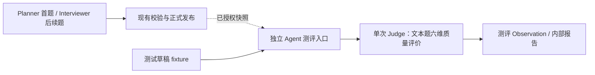

# 题目质量测评：LLM-as-a-Judge

日期：2026-09-21。状态：首版离线测评已实现；验收进度和局限见 [47 实施记录](./47-question-quality-evaluation-tickets.md)。测评不接入正式出题或发布链路。

关联：[40 Java 代码改错题](./40-java-code-repair-spec.md)、[44 原生工具与 Runtime](./44-native-tools-agent-runtime-spec.md)、[45 实施与验收记录](./45-native-tools-agent-runtime-tickets.md)。本规格以用户最新的“暂时只作为 Agent 测评观测，不直接影响出题”要求为准，取代此前讨论的发布前审题门禁与自动修订方案。

## 1. 目标与非目标

引入 LLM-as-a-Judge：使用独立模型调用评价出题 Agent 产物的语义质量，形成可核对的测评 Observation，帮助发现提示词、资料契约及出题策略中的问题。

测评对象是 Planner / Interviewer 生成的题目，不是候选人的能力，也不是 Assessor 对候选人的评分质量。整体面向各岗位、各类题目的出题质量，不限定 Java 或代码判题；首版仅评价文本题。字段合法、引用合法和任务归属正确，不能证明题目条件充分、知识前提正确或作答要求合理。

本阶段明确不做：

- 不增加题目发布前的通过/拒绝门禁，不替代 AgentDecisionValidator 或 CodeQuestionValidator。
- 不自动改题、重出题、撤回题目或重写 reviewGuide；不触发原出题者的修订循环。
- 不将 Judge 结果回注当前或下一轮 InterviewAgentLoop、Planner 提示、WorkingMemory、候选人记忆或正式评估。
- 不把审题意见转换成候选人的负面证据，不重算历史评分。
- 不要求 Planner 与首题生成拆成两次调用；不新增通用角色平台、业务 Loop、运行时工具或恢复状态机。
- 不执行、编译或沙箱运行 Java 代码；模型判断不能被表述为程序执行验证。

即使不设置程序门禁，发布前把 Judge 结果返回出题 Agent 也会影响题目，因此不属于本阶段。名称中的 Observation 指测评观察产物，不直接复用会被业务 Loop 消费的运行时 Observation 通道。

## 2. 首版范围与执行方式

首版覆盖 Planner 首题与 Interviewer 后续生成的 TEXT 文本题（含追问），使用同一套测评服务及量规。范围按题目形式划定，不按 Java、技术栈或岗位划定；测评对象是题目质量，不是候选人答案。CODE_REPAIR 题、代码缺陷验证与私有修复标准比较留待后续阶段。

文本追问若依赖此前公开材料，应纳入必要上下文；缺失时明确记录证据不足，不凭空补齐。首题或后续题若属于范围外的题型，记录范围外原因，不为测评改变实际出题类型。

采用独立、显式启用的离线测评/验收回放入口：读取已发布题目的固定快照，或使用标记为草稿的测试 fixture；两个来源分别统计。测评代码不接入正式请求链路，不要求生产服务为每次出题启动后台任务。



图中没有从测评结果返回业务出题流程的路径。快照读取与模型调用分离，模型调用不持有数据库事务。若未来要自动采样发布后题目，须另行定义采样、资源隔离与触发方案；本规格不据此建设新的生产队列或调度器。

首版每个样例执行一次独立 Judge 调用，评价下述六个维度，不引入代码题两阶段盲审或私有答案核对。

## 3. 服务边界

建议在 Agent 测评模块内使用共用的 `QuestionReviewService`，语义是“评价指定题目快照”，不是“批准发布”。首题和后续题由测评入口适配成同一种输入；生产发布服务暂不注入或调用它。

职责：

1. 投影允许进入测评的材料，执行独立模型调用。
2. 校验 Judge 输出结构及其引用的真实性，汇总六个维度的观察。
3. 返回测评结果、执行状态、耗时、token 与模型/量规版本信息。

它不读取任意用户资源、不推断资源归属、不选择下一题、不写正式会话/评估。入口必须先完成账号/租户/会话授权；测试 fixture 与真实快照使用不同来源标记。

优先复用已有 Provider 获取、plain client、结构化输出解析、DeadlineExecutor、输入预算与 usage 遥测。Judge 不开放工具，也不使用出题 Agent 的对话记忆。内部小 DTO 随服务内嵌；不为了首版创建通用评分框架。

## 4. 不可变测评快照

快照至少记录以下信息，实际字段名在实施时沿用现有类型：

| 类别 | 内容与约束 |
| --- | --- |
| 来源 | 已发布题 / fixture 草稿、首题 / 后续题、会话与轮次定位；身份定位仅留服务端 |
| 公共材料 | question.content、候选人可见的理由或追问、作答要求及必要的公开上下文 |
| 考察意图 | 所选 Target / Gap 的必要说明，仅用于考察聚焦判断，不作为候选人已知条件或正确答案 |
| 相关历史 | 重复检查需要的已发布问题、实际考察点及有来源的已验证情况；不得编造“已掌握”结论 |
| 版本 | 公共材料摘要、完整测评材料摘要、生成模型与提示版本（可获取时）、Judge 模型、量规/提示版本 |

以允许字段投影文本题材料，禁止直接序列化完整业务实体或传入 reviewGuide、私有参考答案。仅已存在且候选人实际能看到的解释进入公开材料；没有公开理由时不得把内部推理当作候选人已知条件。

不需要完整 JD、简历、账号信息或全场回答时不传入。历史去重所用的验证摘要必须有正式来源，且截断至该题生成时可获得的信息；不能把本题之后的回答或评级带入测评，也不能把另一模型的猜测当作候选人已验证事实。无法恢复当时的验证情况时标记缺失，重复性判断可返回证据不足，不用后来的结论补齐。

材料摘要覆盖题面、公开上下文、作答要求、考察意图及用于比较的历史快照。题面文字不变但关联材料变化，也必须形成新测评版本；旧 Observation 不覆盖新版本。

## 5. 文本题的独立评价

Judge 使用新的上下文，一次接收公开题面、作答要求、必要公开材料、考察意图及生成当时的相关历史。输入应明确区分“候选人可见材料”与“仅用于测评的意图/历史”，不能用内部 Target / Gap 补齐题面缺失的条件。

不传入私有参考答案、reviewGuide、作者内部推理、本题回答、后续回答或后续评级。生成时已经存在的历史仅用于判断追问是否合理、是否重复及上下文是否充分；历史结论须有正式来源。

Judge 对六维逐项给出观察、依据与不确定性。开放讨论题允许候选人明确假设、比较方案或追问需求；缺少唯一答案、没有穷尽背景或存在多种合理方案，不自动构成题目缺陷。只有缺失信息妨碍题目要求的判断，或题目强求不成立的结论时，才应报告具体问题。

技术正确性侧重文本题中的事实前提、概念和可成立性；不要求编译代码或证明隐藏缺陷。验收合理性仅评价公开作答要求是否公平、是否暗设唯一方案；没有私有标准时不能声称已验证实际评分量规。信息泄漏评价题面是否直接代答或不当引导，不凭空声称与未提供的私有答案一致。

Judge 可以与出题者使用相同 Provider / 模型，但不继承出题对话状态；同模型仍可能存在共同偏差。只有配置并实际运行不同模型时，才称为跨模型审查。

## 6. 六维测评量规

| 维度 | Judge 应回答的问题 | 典型问题 |
| --- | --- | --- |
| 可回答性 | 公开条件是否足以形成有依据的答案？ | 要求给出唯一性能结论，却未说明影响比较的负载条件 |
| 技术正确性 | 概念、事实前提及要求证明的结论是否成立？ | 将错误的事务隔离结论当成已知事实 |
| 验收合理性 | 公开作答要求是否合理，是否允许不同的有效思路？ | 未限定条件却要求某一方案必然最优 |
| 考察聚焦 | 题目主要验证哪个能力点，与所选 Target / Gap 是否一致？ | 一题堆入多个无关目标，无法解释实际考察重点 |
| 信息泄漏 | 可见题面、理由或追问是否直接代答或不当引导？ | 在提问理由中给出待考察机制的完整答案 |
| 无意重复 | 是否重复已经验证的机制，而没有新的验证意图？ | 仅换措辞再问一次已充分解释的相同问题 |

合理追问不算重复：同一场景继续验证尚未回答的并发、失败或边界条件，应保留其考察意图。简单的文本相似不能替代这一判断。

说明运行前提和接口能力通常是必要契约，不自动视为泄漏；泄漏判断必须说明这些内容为何直接提供了待考察的答案，而不是因为出现技术术语就报警。

首版每维采用 `ISSUES_FOUND` / `NO_ISSUE_FOUND` / `INSUFFICIENT_EVIDENCE`，不产生用于业务放行的总分、合格线或布尔 approved。`NO_ISSUE_FOUND` 只表示此 Judge 在给定材料中未发现问题，不表示正确性已经证明。

## 7. Observation 与异常语义

一次完整测评包含执行元数据、六维观察，以及可选的人工复核标记。

每条问题应包含：维度、严重程度（HIGH / MEDIUM / LOW，仅用于内部排序）、具体问题、对应来源路径及逐字摘录、触发条件/反例、解释和待核实项。改进建议描述需要明确的契约或满足的性质，不自动生成并替换正式题目。

例如：

```json
{
  "dimension": "ANSWERABILITY",
  "finding": "ISSUES_FOUND",
  "severity": "HIGH",
  "sourcePath": "publicQuestion.content",
  "quote": "请证明任何负载下加索引都能提高数据库性能",
  "issue": "题目要求证明无条件成立的性能结论，前提不成立",
  "scenario": "写密集负载下，维护额外索引可能增加写入开销",
  "suggestion": "改为讨论索引的收益、代价及适用条件；此建议仅记录，不自动改题"
}
```

以上是一个观察示例，不是最终接口定义，也不是拒绝发布指令。

Java 校验六维是否齐全、字段组合是否合法，以及摘录是否来自所指定快照。引用位置由服务端按原文定位；重复片段须消歧，禁止宽松匹配、自动编造引用或引用不存在的接口。引用真实性不等于技术结论正确。

执行状态与内容评价必须分开：

- `COMPLETED`：单次文本题评价执行且结果契约通过；可以包含严重问题或证据不足。
- `FAILED`：模型超时、不可用、输出非法或引用校验失败。可以保留诊断信息，但不能统计为完整测评完成。
- `SKIPPED`：未启用、未采样或预算不足以开始；记录原因，不计入质量结论。

非法 Judge 输出不修复为默认成功。`INSUFFICIENT_EVIDENCE` 是一次有效审查的认识边界，不是调用失败；它也不能被归入“无问题”。

## 8. 资源与测评产物

首版每个文本题样例最多一次实际 Provider 请求；使用现有严格单次结构化调用路径，关闭该测评路径中的自动解析修复、网络重试及隐藏工具循环，避免底层重试绕过总调用预算；不自动修订题目，不为得到通过结论反复重跑。人为显式重跑形成新的测评 attempt，不覆盖旧失败。

每个样例从开始到结束使用同一个绝对 deadline；输入和输出有明确 token 上限，并记录真实 usage。具体时间与 token 配额由测评配置显式给出，实施时基于真实耗时确定，不通过扩大生产答题预算容纳审查。

测评不占用正式答题线程池、队列或本轮 deadline；首版独立执行入口不要求新增常驻 worker。默认不开启生产全量测评，批量运行需限制并发和总样本预算。

首版使用独立测评产物文件/报告，不新增业务表、Flyway 迁移或持久任务状态。正式数据库仍保存题目事实；测评报告仅保存不可变样例快照及其派生观察，不成为运行时第二事实源。产物与 fixture 原文不默认提交 Git，日志和对外摘要不包含密钥、候选人原文或私有参考。

报告记录 sampleId、snapshotHash、run/attempt、代码提交版本、可获取的生成配置、Judge 配置、量规与提示版本、时间、调用数、tokens、执行状态及六维结果。历史生成配置缺失时标为未知，不补造。只有确有计费数据时报告成本，不从 token 数猜测费用。

报告只对授权内部测评人员可见；共享示例需脱敏或使用合成材料。Judge 的测评结论不输出到候选人 HTTP/SSE/MCP 响应。

## 9. Judge 自身的校准与指标

建立小规模人工标注样例集，覆盖不同岗位的正常文本题、开放讨论题、必要条件缺失、错误知识前提、不合理唯一解要求、直接代答、合理追问和无意重复。每项标签记录理由和可核对依据；争议样例保留为争议，不强造统一真值。

比较生成策略或提示版本时固定样例集及 Judge 配置，分开记录生成变化与评审变化。关注：

- 覆盖情况：适用样本、计划测评、COMPLETED、FAILED、SKIPPED 数量及失败原因。
- 质量观察：六维问题分布、证据不足比例、首题、后续题与不同岗位的差异。
- 审查可靠性：人工复核后的误报/漏报、同一样例多次运行的一致性、Judge 与人工意见分歧的复核结果。
- 资源成本：调用数、tokens、耗时分布；失败样例也计入消耗。

分母必须明确，不用只成功执行的样例掩盖大规模审查失败。初期不以自动总分排名生成模型，不把自报置信度当作准确率，也不据观测结果自动调业务参数。

## 10. 验收要求

1. 不同岗位的 TEXT 首题、后续题和追问通过同一快照契约进行测评；CODE_REPAIR 明确标为范围外，原 Planner/Interviewer 发布路径保持不变。
2. 捕获实际 Judge 请求，证明没有 reviewGuide、私有参考答案、本题及未来回答/评级或作者内部推理；公开材料与内部考察意图区分明确，历史截断至生成时。
3. 对错误知识前提和影响作答的必要条件缺失报告具体问题；对开放讨论、多种合理思路和正常追问不强制判错。模型判断质量用标注集及人工复核验收，不用固定字符串断言冒充语义正确性。
4. Judge 超时、非法 JSON、非法引用均明确记录；已有题目、答案、评级、WorkingMemory 与后续模型输入不变。
5. 每样例遵守单次实际请求、测评 deadline 及输入输出限额；取消后迟到结果不覆盖新版本，重跑保留旧 attempt。
6. 题目或契约变更导致样例摘要改变；旧观察只能指向旧快照。重复导入不会把不同版本混成一个样本。
7. 测评产物及日志不泄漏私有标准到候选人渠道；报告区分“执行成功”“未发现问题”和“技术正确性已被证明”。
8. 真实 Judge 抽样报告同时列出成功、失败、分歧与人工复核结果；离线 fixture 通过不能宣称真实审查质量已通过。

## 11. 后续阶段边界

后续可扩展到代码题及其他题型，不限定 Java。新代码题可另行设计“公开材料独立盲审，再核对私有 reviewGuide”的两阶段评价；不把它作为首版文本题的实现或验收要求。

未来可以讨论把审查意见提供给下一轮 Agent，或建立发布前门禁、有限修订，但这都改变当前业务行为，须单独更新规格并获授权。

在积累 Judge 误报/漏报和资源数据之前，本模块只作为 Agent 测评中的语义质量观测器。本文不授权实施后台审查、接入生产发布或启用自动修订。
